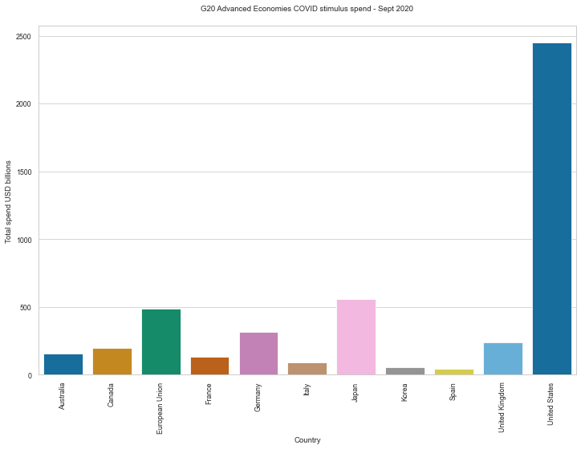
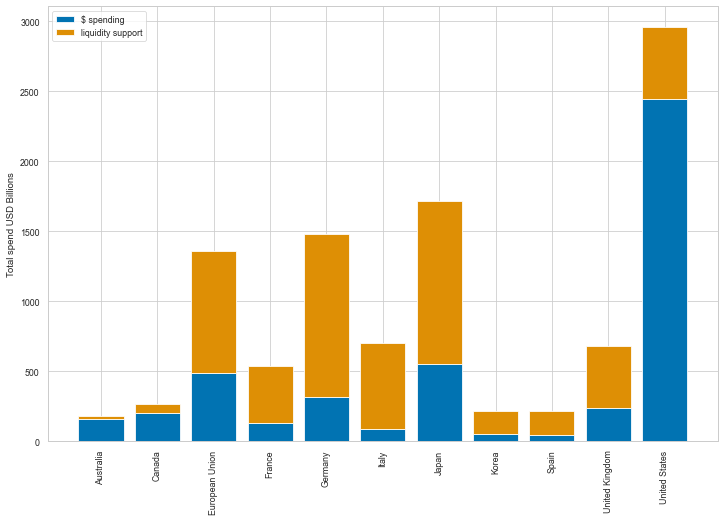
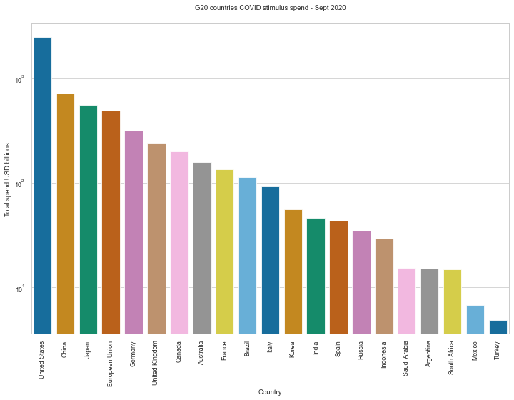

# Data cleaning and reshaping

## 1. Overview

This project will explore common data cleaning tasks such as dealing with:
- data type constraints, 
- uniqueness constraints,
- categorical constraints, 
- text data,
- cross field validation, and 
- complteness.

## 2. The data

The data for this project was lifted from the International Monetary Fund's (IMF) Fiscal Monitor Database of Country Fiscal Measures in Response to the COVID-19 Pandemic which can be found here: https://www.imf.org/en/Topics/imf-and-covid19/Fiscal-Policies-Database-in-Response-to-COVID-19.

This database summarises key fiscal measures governments around the world have announced or taken in response to the COVID-19 pandemic as of September 11, 2020. 

The database categorizes different types of fiscal support (for example, above-the-line and below-the-line measures, and contingent liabilities) that have different implications for public finances in the near term and beyond. 

It focuses on government discretionary measures that supplement existing automatic stabilizers. These existing stabilizers differ across countries in their breadth and scope. In particular (and unsurprisingly), there are stark differences between G20 advanced economies and other countries in emerging markets and low income economies.

The dataset was quite challenging to work with as it contained 53 columns,many headers, plenty of empty cells and unwanted rows. It was interesting to create a few visualisations, once the dataset was clean, in matplotlib and seaborn which displayed valuable insights from what was originally quite a messy and noisy dataset. 

## 3. How to clean & reshape a messy dataset

### Importing an excel file into pandas


```python
#import excel file & see all sheet names in file

import pandas as pd

xl = pd.ExcelFile('imf_fiscal_monitor_global_covid_stimulus.xlsx')

xl.sheet_names
```


    ['Database', 'Summary.Global']


Having examined the file's sheet prior to importing it into a dataframe, I've decided I only want to work with the second sheet ('Summary.Global) as this sheet only contains the relevant numbers (whereas the first sheet ('Database') contains plenty of unnecessary text which I don't want). Therefore, I'll run the command below for the DF to read only the sheet I am interested in.  


```python
# read a specific sheet to DataFrame

df = xl.parse(sheetname='Summary.Global', skiprows=0).head(10)'Summary.Global')

```


```python
#see the dataframe's head to check if headers were read correctly

df.head(10)
```


<div>
<style scoped>
    .dataframe tbody tr th:only-of-type {
        vertical-align: middle;
    }

    .dataframe tbody tr th {
        vertical-align: top;
    }

    .dataframe thead tr th {
        text-align: left;
    }
</style>
<table border="1" class="dataframe">
  <thead>
    <tr>
      <th></th>
      <th>Unnamed: 0_level_0</th>
      <th colspan="9" halign="left">USD Billion</th>
      <th>...</th>
      <th colspan="10" halign="left">Percent of GDP</th>
    </tr>
    <tr>
      <th></th>
      <th>Unnamed: 0_level_1</th>
      <th>Unnamed: 1_level_1</th>
      <th colspan="5" halign="left">Above the line measures</th>
      <th colspan="3" halign="left">Liquidity support</th>
      <th>...</th>
      <th colspan="10" halign="left">Liquidity support</th>
    </tr>
    <tr>
      <th></th>
      <th>Unnamed: 0_level_2</th>
      <th>Unnamed: 1_level_2</th>
      <th>Additional spending or foregone revenues</th>
      <th>Additional spending or foregone revenues.1</th>
      <th>Additional spending or foregone revenues.2</th>
      <th>Accelerated spending / deferred revenue</th>
      <th>Accelerated spending / deferred revenue.1</th>
      <th>Unnamed: 7_level_2</th>
      <th>Below the line measures: equity injections, loans, asset purchase or debt assumptions.</th>
      <th>Below the line measures: equity injections, loans, asset purchase or debt assumptions..1</th>
      <th>...</th>
      <th>Contingent liabilities.21</th>
      <th>Contingent liabilities.22</th>
      <th>Contingent liabilities.23</th>
      <th>Contingent liabilities.24</th>
      <th>Contingent liabilities.25</th>
      <th>Contingent liabilities.26</th>
      <th>Contingent liabilities.27</th>
      <th>Contingent liabilities.28</th>
      <th>Contingent liabilities.29</th>
      <th>Contingent liabilities.30</th>
    </tr>
  </thead>
  <tbody>
    <tr>
      <th>0</th>
      <td>NaN</td>
      <td>NaN</td>
      <td>Subtotal</td>
      <td>Health sector</td>
      <td>Non-health sector</td>
      <td>NaN</td>
      <td>NaN</td>
      <td>Subtotal</td>
      <td>NaN</td>
      <td>NaN</td>
      <td>...</td>
      <td>NaN</td>
      <td>NaN</td>
      <td>NaN</td>
      <td>NaN</td>
      <td>NaN</td>
      <td>NaN</td>
      <td>NaN</td>
      <td>NaN</td>
      <td>NaN</td>
      <td>NaN</td>
    </tr>
    <tr>
      <th>1</th>
      <td>NaN</td>
      <td>G20: Advanced economies</td>
      <td>NaN</td>
      <td>NaN</td>
      <td>NaN</td>
      <td>NaN</td>
      <td>NaN</td>
      <td>NaN</td>
      <td>NaN</td>
      <td>NaN</td>
      <td>...</td>
      <td>NaN</td>
      <td>NaN</td>
      <td>NaN</td>
      <td>NaN</td>
      <td>NaN</td>
      <td>NaN</td>
      <td>NaN</td>
      <td>NaN</td>
      <td>NaN</td>
      <td>NaN</td>
    </tr>
    <tr>
      <th>2</th>
      <td>NaN</td>
      <td>Australia</td>
      <td>156.535</td>
      <td>6.60835</td>
      <td>149.927</td>
      <td>NaN</td>
      <td>NaN</td>
      <td>24.0929</td>
      <td>10.325543</td>
      <td>NaN</td>
      <td>...</td>
      <td>NaN</td>
      <td>NaN</td>
      <td>NaN</td>
      <td>NaN</td>
      <td>NaN</td>
      <td>NaN</td>
      <td>NaN</td>
      <td>NaN</td>
      <td>NaN</td>
      <td>NaN</td>
    </tr>
    <tr>
      <th>3</th>
      <td>NaN</td>
      <td>Canada</td>
      <td>199.625</td>
      <td>14.6936</td>
      <td>184.931</td>
      <td>63.078508</td>
      <td>NaN</td>
      <td>68.0506</td>
      <td>3.858920</td>
      <td>NaN</td>
      <td>...</td>
      <td>NaN</td>
      <td>NaN</td>
      <td>NaN</td>
      <td>NaN</td>
      <td>NaN</td>
      <td>NaN</td>
      <td>NaN</td>
      <td>NaN</td>
      <td>NaN</td>
      <td>NaN</td>
    </tr>
    <tr>
      <th>4</th>
      <td>NaN</td>
      <td>European Union</td>
      <td>489.102</td>
      <td>0.0571581</td>
      <td>489.044</td>
      <td>NaN</td>
      <td>NaN</td>
      <td>874.518</td>
      <td>800.212978</td>
      <td>NaN</td>
      <td>...</td>
      <td>NaN</td>
      <td>NaN</td>
      <td>NaN</td>
      <td>NaN</td>
      <td>NaN</td>
      <td>NaN</td>
      <td>NaN</td>
      <td>NaN</td>
      <td>NaN</td>
      <td>NaN</td>
    </tr>
    <tr>
      <th>5</th>
      <td>NaN</td>
      <td>France</td>
      <td>133.521</td>
      <td>16.0043</td>
      <td>117.517</td>
      <td>64.588619</td>
      <td>NaN</td>
      <td>401.821</td>
      <td>24.006389</td>
      <td>NaN</td>
      <td>...</td>
      <td>NaN</td>
      <td>NaN</td>
      <td>NaN</td>
      <td>NaN</td>
      <td>NaN</td>
      <td>NaN</td>
      <td>NaN</td>
      <td>NaN</td>
      <td>NaN</td>
      <td>NaN</td>
    </tr>
    <tr>
      <th>6</th>
      <td>NaN</td>
      <td>Germany</td>
      <td>315.513</td>
      <td>26.2927</td>
      <td>289.22</td>
      <td>NaN</td>
      <td>NaN</td>
      <td>1166.02</td>
      <td>228.632280</td>
      <td>NaN</td>
      <td>...</td>
      <td>NaN</td>
      <td>NaN</td>
      <td>NaN</td>
      <td>NaN</td>
      <td>NaN</td>
      <td>NaN</td>
      <td>NaN</td>
      <td>NaN</td>
      <td>NaN</td>
      <td>NaN</td>
    </tr>
    <tr>
      <th>7</th>
      <td>NaN</td>
      <td>Italy</td>
      <td>91.4529</td>
      <td>7.43055</td>
      <td>84.0224</td>
      <td>8.002130</td>
      <td>NaN</td>
      <td>609.591</td>
      <td>3.715275</td>
      <td>NaN</td>
      <td>...</td>
      <td>NaN</td>
      <td>NaN</td>
      <td>NaN</td>
      <td>NaN</td>
      <td>NaN</td>
      <td>NaN</td>
      <td>NaN</td>
      <td>NaN</td>
      <td>NaN</td>
      <td>NaN</td>
    </tr>
    <tr>
      <th>8</th>
      <td>NaN</td>
      <td>Japan</td>
      <td>555.088</td>
      <td>47.579</td>
      <td>507.509</td>
      <td>242.559393</td>
      <td>NaN</td>
      <td>1163.35</td>
      <td>NaN</td>
      <td>NaN</td>
      <td>...</td>
      <td>NaN</td>
      <td>NaN</td>
      <td>NaN</td>
      <td>NaN</td>
      <td>NaN</td>
      <td>NaN</td>
      <td>NaN</td>
      <td>NaN</td>
      <td>NaN</td>
      <td>NaN</td>
    </tr>
    <tr>
      <th>9</th>
      <td>NaN</td>
      <td>Korea</td>
      <td>55.3705</td>
      <td>4.25927</td>
      <td>51.1112</td>
      <td>27.559956</td>
      <td>NaN</td>
      <td>163.606</td>
      <td>NaN</td>
      <td>NaN</td>
      <td>...</td>
      <td>NaN</td>
      <td>NaN</td>
      <td>NaN</td>
      <td>NaN</td>
      <td>NaN</td>
      <td>NaN</td>
      <td>NaN</td>
      <td>NaN</td>
      <td>NaN</td>
      <td>NaN</td>
    </tr>
  </tbody>
</table>
<p>10 rows × 53 columns</p>
</div>


### Getting rid of headers and unnecessary rows

When we look at the output, it's clear that the table will need some more work before we can use it as a standard dataframe. 

First, we need to get rid of the extra rows incorporated above which represent various headings in the original table. The actual data we are interested in starts in row 2. 

By using the skiprows argument we can drop the unnecessary clutter (see below). 

Also, note that it will be easier to simply get rid of all existing column names and rename then again one we've gotten rid of the junk rows. The below looks a lot cleaner already!

I like to print the DF's head (this time I specified the first 20 rows) to check the changes were made and confirm if there's any further cleaning required.


```python
df = pd.read_excel(xl, 'Summary.Global', skiprows=6)
df.head(20)
```


<div>
<style scoped>
    .dataframe tbody tr th:only-of-type {
        vertical-align: middle;
    }

    .dataframe tbody tr th {
        vertical-align: top;
    }

    .dataframe thead th {
        text-align: right;
    }
</style>
<table border="1" class="dataframe">
  <thead>
    <tr style="text-align: right;">
      <th></th>
      <th>Unnamed: 0</th>
      <th>G20: Advanced economies</th>
      <th>Unnamed: 2</th>
      <th>Unnamed: 3</th>
      <th>Unnamed: 4</th>
      <th>Unnamed: 5</th>
      <th>Unnamed: 6</th>
      <th>Unnamed: 7</th>
      <th>Unnamed: 8</th>
      <th>Unnamed: 9</th>
      <th>...</th>
      <th>Unnamed: 43</th>
      <th>Unnamed: 44</th>
      <th>Unnamed: 45</th>
      <th>Unnamed: 46</th>
      <th>Unnamed: 47</th>
      <th>Unnamed: 48</th>
      <th>Unnamed: 49</th>
      <th>Unnamed: 50</th>
      <th>Unnamed: 51</th>
      <th>Unnamed: 52</th>
    </tr>
  </thead>
  <tbody>
    <tr>
      <th>0</th>
      <td>NaN</td>
      <td>Australia</td>
      <td>156.535233</td>
      <td>6.608348</td>
      <td>149.926886</td>
      <td>NaN</td>
      <td>NaN</td>
      <td>24.092934</td>
      <td>10.325543</td>
      <td>NaN</td>
      <td>...</td>
      <td>NaN</td>
      <td>NaN</td>
      <td>NaN</td>
      <td>NaN</td>
      <td>NaN</td>
      <td>NaN</td>
      <td>NaN</td>
      <td>NaN</td>
      <td>NaN</td>
      <td>NaN</td>
    </tr>
    <tr>
      <th>1</th>
      <td>NaN</td>
      <td>Canada</td>
      <td>199.624925</td>
      <td>14.693582</td>
      <td>184.931343</td>
      <td>63.078508</td>
      <td>NaN</td>
      <td>68.050579</td>
      <td>3.858920</td>
      <td>NaN</td>
      <td>...</td>
      <td>NaN</td>
      <td>NaN</td>
      <td>NaN</td>
      <td>NaN</td>
      <td>NaN</td>
      <td>NaN</td>
      <td>NaN</td>
      <td>NaN</td>
      <td>NaN</td>
      <td>NaN</td>
    </tr>
    <tr>
      <th>2</th>
      <td>NaN</td>
      <td>European Union</td>
      <td>489.101604</td>
      <td>0.057158</td>
      <td>489.044446</td>
      <td>NaN</td>
      <td>NaN</td>
      <td>874.518469</td>
      <td>800.212978</td>
      <td>NaN</td>
      <td>...</td>
      <td>NaN</td>
      <td>NaN</td>
      <td>NaN</td>
      <td>NaN</td>
      <td>NaN</td>
      <td>NaN</td>
      <td>NaN</td>
      <td>NaN</td>
      <td>NaN</td>
      <td>NaN</td>
    </tr>
    <tr>
      <th>3</th>
      <td>NaN</td>
      <td>France</td>
      <td>133.521251</td>
      <td>16.004260</td>
      <td>117.516992</td>
      <td>64.588619</td>
      <td>NaN</td>
      <td>401.821231</td>
      <td>24.006389</td>
      <td>NaN</td>
      <td>...</td>
      <td>NaN</td>
      <td>NaN</td>
      <td>NaN</td>
      <td>NaN</td>
      <td>NaN</td>
      <td>NaN</td>
      <td>NaN</td>
      <td>NaN</td>
      <td>NaN</td>
      <td>NaN</td>
    </tr>
    <tr>
      <th>4</th>
      <td>NaN</td>
      <td>Germany</td>
      <td>315.512546</td>
      <td>26.292712</td>
      <td>289.219834</td>
      <td>NaN</td>
      <td>NaN</td>
      <td>1166.024626</td>
      <td>228.632280</td>
      <td>NaN</td>
      <td>...</td>
      <td>NaN</td>
      <td>NaN</td>
      <td>NaN</td>
      <td>NaN</td>
      <td>NaN</td>
      <td>NaN</td>
      <td>NaN</td>
      <td>NaN</td>
      <td>NaN</td>
      <td>NaN</td>
    </tr>
    <tr>
      <th>5</th>
      <td>NaN</td>
      <td>Italy</td>
      <td>91.452912</td>
      <td>7.430549</td>
      <td>84.022363</td>
      <td>8.002130</td>
      <td>NaN</td>
      <td>609.590815</td>
      <td>3.715275</td>
      <td>NaN</td>
      <td>...</td>
      <td>NaN</td>
      <td>NaN</td>
      <td>NaN</td>
      <td>NaN</td>
      <td>NaN</td>
      <td>NaN</td>
      <td>NaN</td>
      <td>NaN</td>
      <td>NaN</td>
      <td>NaN</td>
    </tr>
    <tr>
      <th>6</th>
      <td>NaN</td>
      <td>Japan</td>
      <td>555.087841</td>
      <td>47.578958</td>
      <td>507.508884</td>
      <td>242.559393</td>
      <td>NaN</td>
      <td>1163.352165</td>
      <td>NaN</td>
      <td>NaN</td>
      <td>...</td>
      <td>NaN</td>
      <td>NaN</td>
      <td>NaN</td>
      <td>NaN</td>
      <td>NaN</td>
      <td>NaN</td>
      <td>NaN</td>
      <td>NaN</td>
      <td>NaN</td>
      <td>NaN</td>
    </tr>
    <tr>
      <th>7</th>
      <td>NaN</td>
      <td>Korea</td>
      <td>55.370458</td>
      <td>4.259266</td>
      <td>51.111192</td>
      <td>27.559956</td>
      <td>NaN</td>
      <td>163.605923</td>
      <td>NaN</td>
      <td>NaN</td>
      <td>...</td>
      <td>NaN</td>
      <td>NaN</td>
      <td>NaN</td>
      <td>NaN</td>
      <td>NaN</td>
      <td>NaN</td>
      <td>NaN</td>
      <td>NaN</td>
      <td>NaN</td>
      <td>NaN</td>
    </tr>
    <tr>
      <th>8</th>
      <td>NaN</td>
      <td>Spain</td>
      <td>43.554449</td>
      <td>6.058755</td>
      <td>37.495694</td>
      <td>NaN</td>
      <td>NaN</td>
      <td>176.732752</td>
      <td>0.685897</td>
      <td>NaN</td>
      <td>...</td>
      <td>NaN</td>
      <td>NaN</td>
      <td>NaN</td>
      <td>NaN</td>
      <td>NaN</td>
      <td>NaN</td>
      <td>NaN</td>
      <td>NaN</td>
      <td>NaN</td>
      <td>NaN</td>
    </tr>
    <tr>
      <th>9</th>
      <td>NaN</td>
      <td>United Kingdom</td>
      <td>241.441427</td>
      <td>40.752852</td>
      <td>200.688574</td>
      <td>5.126145</td>
      <td>NaN</td>
      <td>437.003856</td>
      <td>1.281536</td>
      <td>NaN</td>
      <td>...</td>
      <td>NaN</td>
      <td>NaN</td>
      <td>NaN</td>
      <td>NaN</td>
      <td>NaN</td>
      <td>NaN</td>
      <td>NaN</td>
      <td>NaN</td>
      <td>NaN</td>
      <td>NaN</td>
    </tr>
    <tr>
      <th>10</th>
      <td>NaN</td>
      <td>United States</td>
      <td>2449.000000</td>
      <td>304.000000</td>
      <td>2145.000000</td>
      <td>18.000000</td>
      <td>NaN</td>
      <td>510.000000</td>
      <td>56.000000</td>
      <td>NaN</td>
      <td>...</td>
      <td>NaN</td>
      <td>NaN</td>
      <td>NaN</td>
      <td>NaN</td>
      <td>NaN</td>
      <td>NaN</td>
      <td>NaN</td>
      <td>NaN</td>
      <td>NaN</td>
      <td>NaN</td>
    </tr>
    <tr>
      <th>11</th>
      <td>NaN</td>
      <td>G20: Emerging markets</td>
      <td>NaN</td>
      <td>NaN</td>
      <td>NaN</td>
      <td>NaN</td>
      <td>NaN</td>
      <td>NaN</td>
      <td>NaN</td>
      <td>NaN</td>
      <td>...</td>
      <td>NaN</td>
      <td>NaN</td>
      <td>NaN</td>
      <td>NaN</td>
      <td>NaN</td>
      <td>NaN</td>
      <td>NaN</td>
      <td>NaN</td>
      <td>NaN</td>
      <td>NaN</td>
    </tr>
    <tr>
      <th>12</th>
      <td>NaN</td>
      <td>Argentina</td>
      <td>15.008567</td>
      <td>0.831680</td>
      <td>14.176887</td>
      <td>0.141925</td>
      <td>NaN</td>
      <td>8.115271</td>
      <td>NaN</td>
      <td>NaN</td>
      <td>...</td>
      <td>NaN</td>
      <td>NaN</td>
      <td>NaN</td>
      <td>NaN</td>
      <td>NaN</td>
      <td>NaN</td>
      <td>NaN</td>
      <td>NaN</td>
      <td>NaN</td>
      <td>NaN</td>
    </tr>
    <tr>
      <th>13</th>
      <td>NaN</td>
      <td>Brazil</td>
      <td>112.857921</td>
      <td>12.196684</td>
      <td>100.661237</td>
      <td>38.944474</td>
      <td>NaN</td>
      <td>86.399609</td>
      <td>13.489687</td>
      <td>NaN</td>
      <td>...</td>
      <td>NaN</td>
      <td>NaN</td>
      <td>NaN</td>
      <td>NaN</td>
      <td>NaN</td>
      <td>NaN</td>
      <td>NaN</td>
      <td>NaN</td>
      <td>NaN</td>
      <td>NaN</td>
    </tr>
    <tr>
      <th>14</th>
      <td>NaN</td>
      <td>China</td>
      <td>706.666811</td>
      <td>21.832707</td>
      <td>684.834104</td>
      <td>237.634909</td>
      <td>NaN</td>
      <td>197.534018</td>
      <td>NaN</td>
      <td>NaN</td>
      <td>...</td>
      <td>NaN</td>
      <td>NaN</td>
      <td>NaN</td>
      <td>NaN</td>
      <td>NaN</td>
      <td>NaN</td>
      <td>NaN</td>
      <td>NaN</td>
      <td>NaN</td>
      <td>NaN</td>
    </tr>
    <tr>
      <th>15</th>
      <td>NaN</td>
      <td>India</td>
      <td>46.391484</td>
      <td>4.898353</td>
      <td>41.493131</td>
      <td>9.252444</td>
      <td>NaN</td>
      <td>135.126509</td>
      <td>6.803268</td>
      <td>NaN</td>
      <td>...</td>
      <td>NaN</td>
      <td>NaN</td>
      <td>NaN</td>
      <td>NaN</td>
      <td>NaN</td>
      <td>NaN</td>
      <td>NaN</td>
      <td>NaN</td>
      <td>NaN</td>
      <td>NaN</td>
    </tr>
    <tr>
      <th>16</th>
      <td>NaN</td>
      <td>Indonesia</td>
      <td>29.033085</td>
      <td>5.197914</td>
      <td>23.835171</td>
      <td>NaN</td>
      <td>NaN</td>
      <td>12.663076</td>
      <td>2.404035</td>
      <td>NaN</td>
      <td>...</td>
      <td>NaN</td>
      <td>NaN</td>
      <td>NaN</td>
      <td>NaN</td>
      <td>NaN</td>
      <td>NaN</td>
      <td>NaN</td>
      <td>NaN</td>
      <td>NaN</td>
      <td>NaN</td>
    </tr>
    <tr>
      <th>17</th>
      <td>NaN</td>
      <td>Mexico</td>
      <td>6.745500</td>
      <td>1.831772</td>
      <td>4.913728</td>
      <td>2.124855</td>
      <td>NaN</td>
      <td>4.716813</td>
      <td>1.740183</td>
      <td>NaN</td>
      <td>...</td>
      <td>NaN</td>
      <td>NaN</td>
      <td>NaN</td>
      <td>NaN</td>
      <td>NaN</td>
      <td>NaN</td>
      <td>NaN</td>
      <td>NaN</td>
      <td>NaN</td>
      <td>NaN</td>
    </tr>
    <tr>
      <th>18</th>
      <td>NaN</td>
      <td>Russia</td>
      <td>34.958261</td>
      <td>3.245425</td>
      <td>31.698847</td>
      <td>6.043205</td>
      <td>NaN</td>
      <td>14.968123</td>
      <td>0.979223</td>
      <td>NaN</td>
      <td>...</td>
      <td>NaN</td>
      <td>NaN</td>
      <td>NaN</td>
      <td>NaN</td>
      <td>NaN</td>
      <td>NaN</td>
      <td>NaN</td>
      <td>NaN</td>
      <td>NaN</td>
      <td>NaN</td>
    </tr>
    <tr>
      <th>19</th>
      <td>NaN</td>
      <td>Saudi Arabia</td>
      <td>15.360000</td>
      <td>12.533333</td>
      <td>2.826667</td>
      <td>12.800000</td>
      <td>NaN</td>
      <td>5.866667</td>
      <td>5.866667</td>
      <td>NaN</td>
      <td>...</td>
      <td>NaN</td>
      <td>NaN</td>
      <td>NaN</td>
      <td>NaN</td>
      <td>NaN</td>
      <td>NaN</td>
      <td>NaN</td>
      <td>NaN</td>
      <td>NaN</td>
      <td>NaN</td>
    </tr>
  </tbody>
</table>
<p>20 rows × 53 columns</p>
</div>


### Dropping empty and unnecessary columns

As we can see above, there are still various issues with the current DF:

1. it contains 53 columns but as we can see above cols 43-53 all contain NaN values and are redundant columns. We need to drop these 'junk' columns from the table (as you can see above they all contain null values). 

Additionally the table is split into essentially 2 tables: 1) country spending in USD billions and 2) country spending as % of GDP. We want to only keep the columns relating to (1) here. We'll create a separate dataframe in due course to analys the GDP figures.

2. we need to rename the 'unnamed' columns based on the original data so it all makes sense. 

3. we need to set name column '0' as 'category' and populate it with the relevant category for each country ("G20 Advanced economies", "G20 Emerging markets" etc.) - currently, these categories appear as separate rows/headers within the table which is not only confusing but will make it impossible to analyse the table according to these categories (for example if we wanted to group by category or perform othercategory based analysis).


```python
a = df.columns[43:52].values.tolist()

df.drop(a,1,inplace=True)

df.head()
```


<div>
<style scoped>
    .dataframe tbody tr th:only-of-type {
        vertical-align: middle;
    }

    .dataframe tbody tr th {
        vertical-align: top;
    }

    .dataframe thead th {
        text-align: right;
    }
</style>
<table border="1" class="dataframe">
  <thead>
    <tr style="text-align: right;">
      <th></th>
      <th>Unnamed: 0</th>
      <th>G20: Advanced economies</th>
      <th>Unnamed: 2</th>
      <th>Unnamed: 3</th>
      <th>Unnamed: 4</th>
      <th>Unnamed: 5</th>
      <th>Unnamed: 6</th>
      <th>Unnamed: 7</th>
      <th>Unnamed: 8</th>
      <th>Unnamed: 9</th>
      <th>...</th>
      <th>Unnamed: 11</th>
      <th>Unnamed: 12</th>
      <th>Unnamed: 13</th>
      <th>Unnamed: 14</th>
      <th>Unnamed: 15</th>
      <th>Unnamed: 16</th>
      <th>Unnamed: 17</th>
      <th>Unnamed: 18</th>
      <th>Unnamed: 19</th>
      <th>Unnamed: 20</th>
    </tr>
  </thead>
  <tbody>
    <tr>
      <th>0</th>
      <td>NaN</td>
      <td>Australia</td>
      <td>156.535233</td>
      <td>6.608348</td>
      <td>149.926886</td>
      <td>NaN</td>
      <td>NaN</td>
      <td>24.092934</td>
      <td>10.325543</td>
      <td>NaN</td>
      <td>...</td>
      <td>NaN</td>
      <td>NaN</td>
      <td>NaN</td>
      <td>11.728229</td>
      <td>0.495123</td>
      <td>11.233106</td>
      <td>NaN</td>
      <td>NaN</td>
      <td>1.805136</td>
      <td>0.773630</td>
    </tr>
    <tr>
      <th>1</th>
      <td>NaN</td>
      <td>Canada</td>
      <td>199.624925</td>
      <td>14.693582</td>
      <td>184.931343</td>
      <td>63.078508</td>
      <td>NaN</td>
      <td>68.050579</td>
      <td>3.858920</td>
      <td>NaN</td>
      <td>...</td>
      <td>NaN</td>
      <td>NaN</td>
      <td>NaN</td>
      <td>12.474500</td>
      <td>0.918197</td>
      <td>11.556302</td>
      <td>3.941756</td>
      <td>NaN</td>
      <td>4.252460</td>
      <td>0.241143</td>
    </tr>
    <tr>
      <th>2</th>
      <td>NaN</td>
      <td>European Union</td>
      <td>489.101604</td>
      <td>0.057158</td>
      <td>489.044446</td>
      <td>NaN</td>
      <td>NaN</td>
      <td>874.518469</td>
      <td>800.212978</td>
      <td>NaN</td>
      <td>...</td>
      <td>NaN</td>
      <td>NaN</td>
      <td>NaN</td>
      <td>3.847573</td>
      <td>0.000450</td>
      <td>3.847124</td>
      <td>NaN</td>
      <td>NaN</td>
      <td>6.879499</td>
      <td>6.294966</td>
    </tr>
    <tr>
      <th>3</th>
      <td>NaN</td>
      <td>France</td>
      <td>133.521251</td>
      <td>16.004260</td>
      <td>117.516992</td>
      <td>64.588619</td>
      <td>NaN</td>
      <td>401.821231</td>
      <td>24.006389</td>
      <td>NaN</td>
      <td>...</td>
      <td>NaN</td>
      <td>NaN</td>
      <td>NaN</td>
      <td>5.233149</td>
      <td>0.627261</td>
      <td>4.605888</td>
      <td>2.531446</td>
      <td>NaN</td>
      <td>15.748733</td>
      <td>0.940892</td>
    </tr>
    <tr>
      <th>4</th>
      <td>NaN</td>
      <td>Germany</td>
      <td>315.512546</td>
      <td>26.292712</td>
      <td>289.219834</td>
      <td>NaN</td>
      <td>NaN</td>
      <td>1166.024626</td>
      <td>228.632280</td>
      <td>NaN</td>
      <td>...</td>
      <td>NaN</td>
      <td>NaN</td>
      <td>NaN</td>
      <td>8.345672</td>
      <td>0.695473</td>
      <td>7.650199</td>
      <td>NaN</td>
      <td>NaN</td>
      <td>30.842700</td>
      <td>6.047588</td>
    </tr>
  </tbody>
</table>
<p>5 rows × 21 columns</p>
</div>


```python
#drop additional unrequired columns index 15 to 21

b = df.columns[14:21].values.tolist()

df.drop(b,1, inplace=True)

#Check columns are dropped 

df.head()
```


<div>
<style scoped>
    .dataframe tbody tr th:only-of-type {
        vertical-align: middle;
    }

    .dataframe tbody tr th {
        vertical-align: top;
    }

    .dataframe thead th {
        text-align: right;
    }
</style>
<table border="1" class="dataframe">
  <thead>
    <tr style="text-align: right;">
      <th></th>
      <th>Unnamed: 0</th>
      <th>G20: Advanced economies</th>
      <th>Unnamed: 2</th>
      <th>Unnamed: 3</th>
      <th>Unnamed: 4</th>
      <th>Unnamed: 5</th>
      <th>Unnamed: 6</th>
      <th>Unnamed: 7</th>
      <th>Unnamed: 8</th>
      <th>Unnamed: 9</th>
      <th>Unnamed: 10</th>
      <th>Unnamed: 11</th>
      <th>Unnamed: 12</th>
      <th>Unnamed: 13</th>
    </tr>
  </thead>
  <tbody>
    <tr>
      <th>0</th>
      <td>NaN</td>
      <td>Australia</td>
      <td>156.535233</td>
      <td>6.608348</td>
      <td>149.926886</td>
      <td>NaN</td>
      <td>NaN</td>
      <td>24.092934</td>
      <td>10.325543</td>
      <td>NaN</td>
      <td>13.767391</td>
      <td>NaN</td>
      <td>NaN</td>
      <td>NaN</td>
    </tr>
    <tr>
      <th>1</th>
      <td>NaN</td>
      <td>Canada</td>
      <td>199.624925</td>
      <td>14.693582</td>
      <td>184.931343</td>
      <td>63.078508</td>
      <td>NaN</td>
      <td>68.050579</td>
      <td>3.858920</td>
      <td>NaN</td>
      <td>64.191658</td>
      <td>NaN</td>
      <td>NaN</td>
      <td>NaN</td>
    </tr>
    <tr>
      <th>2</th>
      <td>NaN</td>
      <td>European Union</td>
      <td>489.101604</td>
      <td>0.057158</td>
      <td>489.044446</td>
      <td>NaN</td>
      <td>NaN</td>
      <td>874.518469</td>
      <td>800.212978</td>
      <td>NaN</td>
      <td>74.305491</td>
      <td>NaN</td>
      <td>NaN</td>
      <td>NaN</td>
    </tr>
    <tr>
      <th>3</th>
      <td>NaN</td>
      <td>France</td>
      <td>133.521251</td>
      <td>16.004260</td>
      <td>117.516992</td>
      <td>64.588619</td>
      <td>NaN</td>
      <td>401.821231</td>
      <td>24.006389</td>
      <td>NaN</td>
      <td>377.814842</td>
      <td>NaN</td>
      <td>NaN</td>
      <td>NaN</td>
    </tr>
    <tr>
      <th>4</th>
      <td>NaN</td>
      <td>Germany</td>
      <td>315.512546</td>
      <td>26.292712</td>
      <td>289.219834</td>
      <td>NaN</td>
      <td>NaN</td>
      <td>1166.024626</td>
      <td>228.632280</td>
      <td>NaN</td>
      <td>937.392346</td>
      <td>NaN</td>
      <td>NaN</td>
      <td>NaN</td>
    </tr>
  </tbody>
</table>
</div>


```python
#Find all columns where the entire column is empty

empty_cols = [col for col in df.columns if df[col].isnull().all()]

# Drop these columns from the dataframe

df.drop(empty_cols, axis=1, inplace=True)

#check all empty columns have been dropped

df.head()

#double check what the table currently looks like

df.info()

```

    <class 'pandas.core.frame.DataFrame'>
    RangeIndex: 204 entries, 0 to 203
    Data columns (total 9 columns):
     #   Column                   Non-Null Count  Dtype  
    ---  ------                   --------------  -----  
     0   G20: Advanced economies  200 non-null    object 
     1   Unnamed: 2               181 non-null    float64
     2   Unnamed: 3               164 non-null    float64
     3   Unnamed: 4               165 non-null    float64
     4   Unnamed: 5               64 non-null     float64
     5   Unnamed: 7               102 non-null    float64
     6   Unnamed: 8               80 non-null     float64
     7   Unnamed: 10              75 non-null     float64
     8   Unnamed: 11              35 non-null     float64
    dtypes: float64(8), object(1)
    memory usage: 14.5+ KB


### Renaming columns


```python
#rename columns

df.columns = ["Country","Total_spend", "Health_sector","Non_Health_sector","Deferred_rev", "Total_liquidity_support", "Eq_loans_Asset_Purch", "Guarantees", "Quasi_fiscal_ops"]  
```


```python
#check column names have changed

df.columns
```


    Index(['Country', 'Total_spend', 'Health_sector', 'Non_Health_sector',
           'Deferred_rev', 'Total_liquidity_support', 'Eq_loans_Asset_Purch',
           'Guarantees', 'Quasi_fiscal_ops'],
          dtype='object')


```python
#check all columns are now named

df.info()
```

    <class 'pandas.core.frame.DataFrame'>
    RangeIndex: 204 entries, 0 to 203
    Data columns (total 9 columns):
     #   Column                   Non-Null Count  Dtype  
    ---  ------                   --------------  -----  
     0   Country                  200 non-null    object 
     1   Total_spend              181 non-null    float64
     2   Health_sector            164 non-null    float64
     3   Non_Health_sector        165 non-null    float64
     4   Deferred_rev             64 non-null     float64
     5   Total_liquidity_support  102 non-null    float64
     6   Eq_loans_Asset_Purch     80 non-null     float64
     7   Guarantees               75 non-null     float64
     8   Quasi_fiscal_ops         35 non-null     float64
    dtypes: float64(8), object(1)
    memory usage: 14.5+ KB


```python
df.head()
```


<div>
<style scoped>
    .dataframe tbody tr th:only-of-type {
        vertical-align: middle;
    }

    .dataframe tbody tr th {
        vertical-align: top;
    }

    .dataframe thead th {
        text-align: right;
    }
</style>
<table border="1" class="dataframe">
  <thead>
    <tr style="text-align: right;">
      <th></th>
      <th>Country</th>
      <th>Total_spend</th>
      <th>Health_sector</th>
      <th>Non_Health_sector</th>
      <th>Deferred_rev</th>
      <th>Total_liquidity_support</th>
      <th>Eq_loans_Asset_Purch</th>
      <th>Guarantees</th>
      <th>Quasi_fiscal_ops</th>
    </tr>
  </thead>
  <tbody>
    <tr>
      <th>0</th>
      <td>Australia</td>
      <td>156.535233</td>
      <td>6.608348</td>
      <td>149.926886</td>
      <td>NaN</td>
      <td>24.092934</td>
      <td>10.325543</td>
      <td>13.767391</td>
      <td>NaN</td>
    </tr>
    <tr>
      <th>1</th>
      <td>Canada</td>
      <td>199.624925</td>
      <td>14.693582</td>
      <td>184.931343</td>
      <td>63.078508</td>
      <td>68.050579</td>
      <td>3.858920</td>
      <td>64.191658</td>
      <td>NaN</td>
    </tr>
    <tr>
      <th>2</th>
      <td>European Union</td>
      <td>489.101604</td>
      <td>0.057158</td>
      <td>489.044446</td>
      <td>NaN</td>
      <td>874.518469</td>
      <td>800.212978</td>
      <td>74.305491</td>
      <td>NaN</td>
    </tr>
    <tr>
      <th>3</th>
      <td>France</td>
      <td>133.521251</td>
      <td>16.004260</td>
      <td>117.516992</td>
      <td>64.588619</td>
      <td>401.821231</td>
      <td>24.006389</td>
      <td>377.814842</td>
      <td>NaN</td>
    </tr>
    <tr>
      <th>4</th>
      <td>Germany</td>
      <td>315.512546</td>
      <td>26.292712</td>
      <td>289.219834</td>
      <td>NaN</td>
      <td>1166.024626</td>
      <td>228.632280</td>
      <td>937.392346</td>
      <td>NaN</td>
    </tr>
  </tbody>
</table>
</div>


```python
df.iloc[0:4]
```


<div>
<style scoped>
    .dataframe tbody tr th:only-of-type {
        vertical-align: middle;
    }

    .dataframe tbody tr th {
        vertical-align: top;
    }

    .dataframe thead th {
        text-align: right;
    }
</style>
<table border="1" class="dataframe">
  <thead>
    <tr style="text-align: right;">
      <th></th>
      <th>Country</th>
      <th>Total_spend</th>
      <th>Health_sector</th>
      <th>Non_Health_sector</th>
      <th>Deferred_rev</th>
      <th>Total_liquidity_support</th>
      <th>Eq_loans_Asset_Purch</th>
      <th>Guarantees</th>
      <th>Quasi_fiscal_ops</th>
    </tr>
  </thead>
  <tbody>
    <tr>
      <th>0</th>
      <td>Australia</td>
      <td>156.535233</td>
      <td>6.608348</td>
      <td>149.926886</td>
      <td>NaN</td>
      <td>24.092934</td>
      <td>10.325543</td>
      <td>13.767391</td>
      <td>NaN</td>
    </tr>
    <tr>
      <th>1</th>
      <td>Canada</td>
      <td>199.624925</td>
      <td>14.693582</td>
      <td>184.931343</td>
      <td>63.078508</td>
      <td>68.050579</td>
      <td>3.858920</td>
      <td>64.191658</td>
      <td>NaN</td>
    </tr>
    <tr>
      <th>2</th>
      <td>European Union</td>
      <td>489.101604</td>
      <td>0.057158</td>
      <td>489.044446</td>
      <td>NaN</td>
      <td>874.518469</td>
      <td>800.212978</td>
      <td>74.305491</td>
      <td>NaN</td>
    </tr>
    <tr>
      <th>3</th>
      <td>France</td>
      <td>133.521251</td>
      <td>16.004260</td>
      <td>117.516992</td>
      <td>64.588619</td>
      <td>401.821231</td>
      <td>24.006389</td>
      <td>377.814842</td>
      <td>NaN</td>
    </tr>
  </tbody>
</table>
</div>


### Creating new columns and categories


```python
#insert new empty column in index position 0 into the DF

import numpy as np
NaN = np.nan
df.insert(0,'Region',NaN)
```


```python
#check that new empty column is inserted

df.head()
```


<div>
<style scoped>
    .dataframe tbody tr th:only-of-type {
        vertical-align: middle;
    }

    .dataframe tbody tr th {
        vertical-align: top;
    }

    .dataframe thead th {
        text-align: right;
    }
</style>
<table border="1" class="dataframe">
  <thead>
    <tr style="text-align: right;">
      <th></th>
      <th>Region</th>
      <th>Country</th>
      <th>Total_spend</th>
      <th>Health_sector</th>
      <th>Non_Health_sector</th>
      <th>Deferred_rev</th>
      <th>Total_liquidity_support</th>
      <th>Eq_loans_Asset_Purch</th>
      <th>Guarantees</th>
      <th>Quasi_fiscal_ops</th>
    </tr>
  </thead>
  <tbody>
    <tr>
      <th>0</th>
      <td>NaN</td>
      <td>Australia</td>
      <td>156.535233</td>
      <td>6.608348</td>
      <td>149.926886</td>
      <td>NaN</td>
      <td>24.092934</td>
      <td>10.325543</td>
      <td>13.767391</td>
      <td>NaN</td>
    </tr>
    <tr>
      <th>1</th>
      <td>NaN</td>
      <td>Canada</td>
      <td>199.624925</td>
      <td>14.693582</td>
      <td>184.931343</td>
      <td>63.078508</td>
      <td>68.050579</td>
      <td>3.858920</td>
      <td>64.191658</td>
      <td>NaN</td>
    </tr>
    <tr>
      <th>2</th>
      <td>NaN</td>
      <td>European Union</td>
      <td>489.101604</td>
      <td>0.057158</td>
      <td>489.044446</td>
      <td>NaN</td>
      <td>874.518469</td>
      <td>800.212978</td>
      <td>74.305491</td>
      <td>NaN</td>
    </tr>
    <tr>
      <th>3</th>
      <td>NaN</td>
      <td>France</td>
      <td>133.521251</td>
      <td>16.004260</td>
      <td>117.516992</td>
      <td>64.588619</td>
      <td>401.821231</td>
      <td>24.006389</td>
      <td>377.814842</td>
      <td>NaN</td>
    </tr>
    <tr>
      <th>4</th>
      <td>NaN</td>
      <td>Germany</td>
      <td>315.512546</td>
      <td>26.292712</td>
      <td>289.219834</td>
      <td>NaN</td>
      <td>1166.024626</td>
      <td>228.632280</td>
      <td>937.392346</td>
      <td>NaN</td>
    </tr>
  </tbody>
</table>
</div>


```python
df.Region.iloc[0:12] = 1
df.head(20)
```


<div>
<style scoped>
    .dataframe tbody tr th:only-of-type {
        vertical-align: middle;
    }

    .dataframe tbody tr th {
        vertical-align: top;
    }

    .dataframe thead th {
        text-align: right;
    }
</style>
<table border="1" class="dataframe">
  <thead>
    <tr style="text-align: right;">
      <th></th>
      <th>Region</th>
      <th>Country</th>
      <th>Total_spend</th>
      <th>Health_sector</th>
      <th>Non_Health_sector</th>
      <th>Deferred_rev</th>
      <th>Total_liquidity_support</th>
      <th>Eq_loans_Asset_Purch</th>
      <th>Guarantees</th>
      <th>Quasi_fiscal_ops</th>
    </tr>
  </thead>
  <tbody>
    <tr>
      <th>0</th>
      <td>1</td>
      <td>Australia</td>
      <td>156.535233</td>
      <td>6.608348</td>
      <td>149.926886</td>
      <td>NaN</td>
      <td>24.092934</td>
      <td>10.325543</td>
      <td>13.767391</td>
      <td>NaN</td>
    </tr>
    <tr>
      <th>1</th>
      <td>1</td>
      <td>Canada</td>
      <td>199.624925</td>
      <td>14.693582</td>
      <td>184.931343</td>
      <td>63.078508</td>
      <td>68.050579</td>
      <td>3.858920</td>
      <td>64.191658</td>
      <td>NaN</td>
    </tr>
    <tr>
      <th>2</th>
      <td>1</td>
      <td>European Union</td>
      <td>489.101604</td>
      <td>0.057158</td>
      <td>489.044446</td>
      <td>NaN</td>
      <td>874.518469</td>
      <td>800.212978</td>
      <td>74.305491</td>
      <td>NaN</td>
    </tr>
    <tr>
      <th>3</th>
      <td>1</td>
      <td>France</td>
      <td>133.521251</td>
      <td>16.004260</td>
      <td>117.516992</td>
      <td>64.588619</td>
      <td>401.821231</td>
      <td>24.006389</td>
      <td>377.814842</td>
      <td>NaN</td>
    </tr>
    <tr>
      <th>4</th>
      <td>1</td>
      <td>Germany</td>
      <td>315.512546</td>
      <td>26.292712</td>
      <td>289.219834</td>
      <td>NaN</td>
      <td>1166.024626</td>
      <td>228.632280</td>
      <td>937.392346</td>
      <td>NaN</td>
    </tr>
    <tr>
      <th>5</th>
      <td>1</td>
      <td>Italy</td>
      <td>91.452912</td>
      <td>7.430549</td>
      <td>84.022363</td>
      <td>8.002130</td>
      <td>609.590815</td>
      <td>3.715275</td>
      <td>605.875541</td>
      <td>NaN</td>
    </tr>
    <tr>
      <th>6</th>
      <td>1</td>
      <td>Japan</td>
      <td>555.087841</td>
      <td>47.578958</td>
      <td>507.508884</td>
      <td>242.559393</td>
      <td>1163.352165</td>
      <td>NaN</td>
      <td>146.468556</td>
      <td>1016.883609</td>
    </tr>
    <tr>
      <th>7</th>
      <td>1</td>
      <td>Korea</td>
      <td>55.370458</td>
      <td>4.259266</td>
      <td>51.111192</td>
      <td>27.559956</td>
      <td>163.605923</td>
      <td>NaN</td>
      <td>59.212149</td>
      <td>104.393774</td>
    </tr>
    <tr>
      <th>8</th>
      <td>1</td>
      <td>Spain</td>
      <td>43.554449</td>
      <td>6.058755</td>
      <td>37.495694</td>
      <td>NaN</td>
      <td>176.732752</td>
      <td>0.685897</td>
      <td>164.615241</td>
      <td>11.431614</td>
    </tr>
    <tr>
      <th>9</th>
      <td>1</td>
      <td>United Kingdom</td>
      <td>241.441427</td>
      <td>40.752852</td>
      <td>200.688574</td>
      <td>5.126145</td>
      <td>437.003856</td>
      <td>1.281536</td>
      <td>435.722320</td>
      <td>NaN</td>
    </tr>
    <tr>
      <th>10</th>
      <td>1</td>
      <td>United States</td>
      <td>2449.000000</td>
      <td>304.000000</td>
      <td>2145.000000</td>
      <td>18.000000</td>
      <td>510.000000</td>
      <td>56.000000</td>
      <td>454.000000</td>
      <td>NaN</td>
    </tr>
    <tr>
      <th>11</th>
      <td>1</td>
      <td>G20: Emerging markets</td>
      <td>NaN</td>
      <td>NaN</td>
      <td>NaN</td>
      <td>NaN</td>
      <td>NaN</td>
      <td>NaN</td>
      <td>NaN</td>
      <td>NaN</td>
    </tr>
    <tr>
      <th>12</th>
      <td>NaN</td>
      <td>Argentina</td>
      <td>15.008567</td>
      <td>0.831680</td>
      <td>14.176887</td>
      <td>0.141925</td>
      <td>8.115271</td>
      <td>NaN</td>
      <td>8.115271</td>
      <td>NaN</td>
    </tr>
    <tr>
      <th>13</th>
      <td>NaN</td>
      <td>Brazil</td>
      <td>112.857921</td>
      <td>12.196684</td>
      <td>100.661237</td>
      <td>38.944474</td>
      <td>86.399609</td>
      <td>13.489687</td>
      <td>NaN</td>
      <td>72.909922</td>
    </tr>
    <tr>
      <th>14</th>
      <td>NaN</td>
      <td>China</td>
      <td>706.666811</td>
      <td>21.832707</td>
      <td>684.834104</td>
      <td>237.634909</td>
      <td>197.534018</td>
      <td>NaN</td>
      <td>59.408727</td>
      <td>138.125291</td>
    </tr>
    <tr>
      <th>15</th>
      <td>NaN</td>
      <td>India</td>
      <td>46.391484</td>
      <td>4.898353</td>
      <td>41.493131</td>
      <td>9.252444</td>
      <td>135.126509</td>
      <td>6.803268</td>
      <td>116.077358</td>
      <td>12.245882</td>
    </tr>
    <tr>
      <th>16</th>
      <td>NaN</td>
      <td>Indonesia</td>
      <td>29.033085</td>
      <td>5.197914</td>
      <td>23.835171</td>
      <td>NaN</td>
      <td>12.663076</td>
      <td>2.404035</td>
      <td>10.259041</td>
      <td>NaN</td>
    </tr>
    <tr>
      <th>17</th>
      <td>NaN</td>
      <td>Mexico</td>
      <td>6.745500</td>
      <td>1.831772</td>
      <td>4.913728</td>
      <td>2.124855</td>
      <td>4.716813</td>
      <td>1.740183</td>
      <td>NaN</td>
      <td>2.976629</td>
    </tr>
    <tr>
      <th>18</th>
      <td>NaN</td>
      <td>Russia</td>
      <td>34.958261</td>
      <td>3.245425</td>
      <td>31.698847</td>
      <td>6.043205</td>
      <td>14.968123</td>
      <td>0.979223</td>
      <td>6.994450</td>
      <td>6.994450</td>
    </tr>
    <tr>
      <th>19</th>
      <td>NaN</td>
      <td>Saudi Arabia</td>
      <td>15.360000</td>
      <td>12.533333</td>
      <td>2.826667</td>
      <td>12.800000</td>
      <td>5.866667</td>
      <td>5.866667</td>
      <td>NaN</td>
      <td>NaN</td>
    </tr>
  </tbody>
</table>
</div>


```python
#set values in selected rows of the 'Region' column to region 'ae' (G20 advanced economies)  

df.Region.iloc[0:12] = 'ae'

#Check the top 20 rows to confirm values are correctly set for selected rows

df.head(20)
```

    /Users/racheldulberg/opt/anaconda3/lib/python3.8/site-packages/pandas/core/indexing.py:671: SettingWithCopyWarning: 
    A value is trying to be set on a copy of a slice from a DataFrame
    
    See the caveats in the documentation: https://pandas.pydata.org/pandas-docs/stable/user_guide/indexing.html#returning-a-view-versus-a-copy
      self._setitem_with_indexer(indexer, value)


<div>
<style scoped>
    .dataframe tbody tr th:only-of-type {
        vertical-align: middle;
    }

    .dataframe tbody tr th {
        vertical-align: top;
    }

    .dataframe thead th {
        text-align: right;
    }
</style>
<table border="1" class="dataframe">
  <thead>
    <tr style="text-align: right;">
      <th></th>
      <th>Region</th>
      <th>Country</th>
      <th>Total_spend</th>
      <th>Health_sector</th>
      <th>Non_Health_sector</th>
      <th>Deferred_rev</th>
      <th>Total_liquidity_support</th>
      <th>Eq_loans_Asset_Purch</th>
      <th>Guarantees</th>
      <th>Quasi_fiscal_ops</th>
    </tr>
  </thead>
  <tbody>
    <tr>
      <th>0</th>
      <td>ae</td>
      <td>Australia</td>
      <td>156.535233</td>
      <td>6.608348</td>
      <td>149.926886</td>
      <td>NaN</td>
      <td>24.092934</td>
      <td>10.325543</td>
      <td>13.767391</td>
      <td>NaN</td>
    </tr>
    <tr>
      <th>1</th>
      <td>ae</td>
      <td>Canada</td>
      <td>199.624925</td>
      <td>14.693582</td>
      <td>184.931343</td>
      <td>63.078508</td>
      <td>68.050579</td>
      <td>3.858920</td>
      <td>64.191658</td>
      <td>NaN</td>
    </tr>
    <tr>
      <th>2</th>
      <td>ae</td>
      <td>European Union</td>
      <td>489.101604</td>
      <td>0.057158</td>
      <td>489.044446</td>
      <td>NaN</td>
      <td>874.518469</td>
      <td>800.212978</td>
      <td>74.305491</td>
      <td>NaN</td>
    </tr>
    <tr>
      <th>3</th>
      <td>ae</td>
      <td>France</td>
      <td>133.521251</td>
      <td>16.004260</td>
      <td>117.516992</td>
      <td>64.588619</td>
      <td>401.821231</td>
      <td>24.006389</td>
      <td>377.814842</td>
      <td>NaN</td>
    </tr>
    <tr>
      <th>4</th>
      <td>ae</td>
      <td>Germany</td>
      <td>315.512546</td>
      <td>26.292712</td>
      <td>289.219834</td>
      <td>NaN</td>
      <td>1166.024626</td>
      <td>228.632280</td>
      <td>937.392346</td>
      <td>NaN</td>
    </tr>
    <tr>
      <th>5</th>
      <td>ae</td>
      <td>Italy</td>
      <td>91.452912</td>
      <td>7.430549</td>
      <td>84.022363</td>
      <td>8.002130</td>
      <td>609.590815</td>
      <td>3.715275</td>
      <td>605.875541</td>
      <td>NaN</td>
    </tr>
    <tr>
      <th>6</th>
      <td>ae</td>
      <td>Japan</td>
      <td>555.087841</td>
      <td>47.578958</td>
      <td>507.508884</td>
      <td>242.559393</td>
      <td>1163.352165</td>
      <td>NaN</td>
      <td>146.468556</td>
      <td>1016.883609</td>
    </tr>
    <tr>
      <th>7</th>
      <td>ae</td>
      <td>Korea</td>
      <td>55.370458</td>
      <td>4.259266</td>
      <td>51.111192</td>
      <td>27.559956</td>
      <td>163.605923</td>
      <td>NaN</td>
      <td>59.212149</td>
      <td>104.393774</td>
    </tr>
    <tr>
      <th>8</th>
      <td>ae</td>
      <td>Spain</td>
      <td>43.554449</td>
      <td>6.058755</td>
      <td>37.495694</td>
      <td>NaN</td>
      <td>176.732752</td>
      <td>0.685897</td>
      <td>164.615241</td>
      <td>11.431614</td>
    </tr>
    <tr>
      <th>9</th>
      <td>ae</td>
      <td>United Kingdom</td>
      <td>241.441427</td>
      <td>40.752852</td>
      <td>200.688574</td>
      <td>5.126145</td>
      <td>437.003856</td>
      <td>1.281536</td>
      <td>435.722320</td>
      <td>NaN</td>
    </tr>
    <tr>
      <th>10</th>
      <td>ae</td>
      <td>United States</td>
      <td>2449.000000</td>
      <td>304.000000</td>
      <td>2145.000000</td>
      <td>18.000000</td>
      <td>510.000000</td>
      <td>56.000000</td>
      <td>454.000000</td>
      <td>NaN</td>
    </tr>
    <tr>
      <th>11</th>
      <td>ae</td>
      <td>G20: Emerging markets</td>
      <td>NaN</td>
      <td>NaN</td>
      <td>NaN</td>
      <td>NaN</td>
      <td>NaN</td>
      <td>NaN</td>
      <td>NaN</td>
      <td>NaN</td>
    </tr>
    <tr>
      <th>12</th>
      <td>NaN</td>
      <td>Argentina</td>
      <td>15.008567</td>
      <td>0.831680</td>
      <td>14.176887</td>
      <td>0.141925</td>
      <td>8.115271</td>
      <td>NaN</td>
      <td>8.115271</td>
      <td>NaN</td>
    </tr>
    <tr>
      <th>13</th>
      <td>NaN</td>
      <td>Brazil</td>
      <td>112.857921</td>
      <td>12.196684</td>
      <td>100.661237</td>
      <td>38.944474</td>
      <td>86.399609</td>
      <td>13.489687</td>
      <td>NaN</td>
      <td>72.909922</td>
    </tr>
    <tr>
      <th>14</th>
      <td>NaN</td>
      <td>China</td>
      <td>706.666811</td>
      <td>21.832707</td>
      <td>684.834104</td>
      <td>237.634909</td>
      <td>197.534018</td>
      <td>NaN</td>
      <td>59.408727</td>
      <td>138.125291</td>
    </tr>
    <tr>
      <th>15</th>
      <td>NaN</td>
      <td>India</td>
      <td>46.391484</td>
      <td>4.898353</td>
      <td>41.493131</td>
      <td>9.252444</td>
      <td>135.126509</td>
      <td>6.803268</td>
      <td>116.077358</td>
      <td>12.245882</td>
    </tr>
    <tr>
      <th>16</th>
      <td>NaN</td>
      <td>Indonesia</td>
      <td>29.033085</td>
      <td>5.197914</td>
      <td>23.835171</td>
      <td>NaN</td>
      <td>12.663076</td>
      <td>2.404035</td>
      <td>10.259041</td>
      <td>NaN</td>
    </tr>
    <tr>
      <th>17</th>
      <td>NaN</td>
      <td>Mexico</td>
      <td>6.745500</td>
      <td>1.831772</td>
      <td>4.913728</td>
      <td>2.124855</td>
      <td>4.716813</td>
      <td>1.740183</td>
      <td>NaN</td>
      <td>2.976629</td>
    </tr>
    <tr>
      <th>18</th>
      <td>NaN</td>
      <td>Russia</td>
      <td>34.958261</td>
      <td>3.245425</td>
      <td>31.698847</td>
      <td>6.043205</td>
      <td>14.968123</td>
      <td>0.979223</td>
      <td>6.994450</td>
      <td>6.994450</td>
    </tr>
    <tr>
      <th>19</th>
      <td>NaN</td>
      <td>Saudi Arabia</td>
      <td>15.360000</td>
      <td>12.533333</td>
      <td>2.826667</td>
      <td>12.800000</td>
      <td>5.866667</td>
      <td>5.866667</td>
      <td>NaN</td>
      <td>NaN</td>
    </tr>
  </tbody>
</table>
</div>


```python
#Drop row 11 (as it's a redundant row that should be converted into a region)

df.drop(11, inplace=True)
```


```python
#check row is crrectly deleted

df.head(20)
```


<div>
<style scoped>
    .dataframe tbody tr th:only-of-type {
        vertical-align: middle;
    }

    .dataframe tbody tr th {
        vertical-align: top;
    }

    .dataframe thead th {
        text-align: right;
    }
</style>
<table border="1" class="dataframe">
  <thead>
    <tr style="text-align: right;">
      <th></th>
      <th>Region</th>
      <th>Country</th>
      <th>Total_spend</th>
      <th>Health_sector</th>
      <th>Non_Health_sector</th>
      <th>Deferred_rev</th>
      <th>Total_liquidity_support</th>
      <th>Eq_loans_Asset_Purch</th>
      <th>Guarantees</th>
      <th>Quasi_fiscal_ops</th>
    </tr>
  </thead>
  <tbody>
    <tr>
      <th>0</th>
      <td>ae</td>
      <td>Australia</td>
      <td>156.535233</td>
      <td>6.608348</td>
      <td>149.926886</td>
      <td>NaN</td>
      <td>24.092934</td>
      <td>10.325543</td>
      <td>13.767391</td>
      <td>NaN</td>
    </tr>
    <tr>
      <th>1</th>
      <td>ae</td>
      <td>Canada</td>
      <td>199.624925</td>
      <td>14.693582</td>
      <td>184.931343</td>
      <td>63.078508</td>
      <td>68.050579</td>
      <td>3.858920</td>
      <td>64.191658</td>
      <td>NaN</td>
    </tr>
    <tr>
      <th>2</th>
      <td>ae</td>
      <td>European Union</td>
      <td>489.101604</td>
      <td>0.057158</td>
      <td>489.044446</td>
      <td>NaN</td>
      <td>874.518469</td>
      <td>800.212978</td>
      <td>74.305491</td>
      <td>NaN</td>
    </tr>
    <tr>
      <th>3</th>
      <td>ae</td>
      <td>France</td>
      <td>133.521251</td>
      <td>16.004260</td>
      <td>117.516992</td>
      <td>64.588619</td>
      <td>401.821231</td>
      <td>24.006389</td>
      <td>377.814842</td>
      <td>NaN</td>
    </tr>
    <tr>
      <th>4</th>
      <td>ae</td>
      <td>Germany</td>
      <td>315.512546</td>
      <td>26.292712</td>
      <td>289.219834</td>
      <td>NaN</td>
      <td>1166.024626</td>
      <td>228.632280</td>
      <td>937.392346</td>
      <td>NaN</td>
    </tr>
    <tr>
      <th>5</th>
      <td>ae</td>
      <td>Italy</td>
      <td>91.452912</td>
      <td>7.430549</td>
      <td>84.022363</td>
      <td>8.002130</td>
      <td>609.590815</td>
      <td>3.715275</td>
      <td>605.875541</td>
      <td>NaN</td>
    </tr>
    <tr>
      <th>6</th>
      <td>ae</td>
      <td>Japan</td>
      <td>555.087841</td>
      <td>47.578958</td>
      <td>507.508884</td>
      <td>242.559393</td>
      <td>1163.352165</td>
      <td>NaN</td>
      <td>146.468556</td>
      <td>1016.883609</td>
    </tr>
    <tr>
      <th>7</th>
      <td>ae</td>
      <td>Korea</td>
      <td>55.370458</td>
      <td>4.259266</td>
      <td>51.111192</td>
      <td>27.559956</td>
      <td>163.605923</td>
      <td>NaN</td>
      <td>59.212149</td>
      <td>104.393774</td>
    </tr>
    <tr>
      <th>8</th>
      <td>ae</td>
      <td>Spain</td>
      <td>43.554449</td>
      <td>6.058755</td>
      <td>37.495694</td>
      <td>NaN</td>
      <td>176.732752</td>
      <td>0.685897</td>
      <td>164.615241</td>
      <td>11.431614</td>
    </tr>
    <tr>
      <th>9</th>
      <td>ae</td>
      <td>United Kingdom</td>
      <td>241.441427</td>
      <td>40.752852</td>
      <td>200.688574</td>
      <td>5.126145</td>
      <td>437.003856</td>
      <td>1.281536</td>
      <td>435.722320</td>
      <td>NaN</td>
    </tr>
    <tr>
      <th>10</th>
      <td>ae</td>
      <td>United States</td>
      <td>2449.000000</td>
      <td>304.000000</td>
      <td>2145.000000</td>
      <td>18.000000</td>
      <td>510.000000</td>
      <td>56.000000</td>
      <td>454.000000</td>
      <td>NaN</td>
    </tr>
    <tr>
      <th>12</th>
      <td>NaN</td>
      <td>Argentina</td>
      <td>15.008567</td>
      <td>0.831680</td>
      <td>14.176887</td>
      <td>0.141925</td>
      <td>8.115271</td>
      <td>NaN</td>
      <td>8.115271</td>
      <td>NaN</td>
    </tr>
    <tr>
      <th>13</th>
      <td>NaN</td>
      <td>Brazil</td>
      <td>112.857921</td>
      <td>12.196684</td>
      <td>100.661237</td>
      <td>38.944474</td>
      <td>86.399609</td>
      <td>13.489687</td>
      <td>NaN</td>
      <td>72.909922</td>
    </tr>
    <tr>
      <th>14</th>
      <td>NaN</td>
      <td>China</td>
      <td>706.666811</td>
      <td>21.832707</td>
      <td>684.834104</td>
      <td>237.634909</td>
      <td>197.534018</td>
      <td>NaN</td>
      <td>59.408727</td>
      <td>138.125291</td>
    </tr>
    <tr>
      <th>15</th>
      <td>NaN</td>
      <td>India</td>
      <td>46.391484</td>
      <td>4.898353</td>
      <td>41.493131</td>
      <td>9.252444</td>
      <td>135.126509</td>
      <td>6.803268</td>
      <td>116.077358</td>
      <td>12.245882</td>
    </tr>
    <tr>
      <th>16</th>
      <td>NaN</td>
      <td>Indonesia</td>
      <td>29.033085</td>
      <td>5.197914</td>
      <td>23.835171</td>
      <td>NaN</td>
      <td>12.663076</td>
      <td>2.404035</td>
      <td>10.259041</td>
      <td>NaN</td>
    </tr>
    <tr>
      <th>17</th>
      <td>NaN</td>
      <td>Mexico</td>
      <td>6.745500</td>
      <td>1.831772</td>
      <td>4.913728</td>
      <td>2.124855</td>
      <td>4.716813</td>
      <td>1.740183</td>
      <td>NaN</td>
      <td>2.976629</td>
    </tr>
    <tr>
      <th>18</th>
      <td>NaN</td>
      <td>Russia</td>
      <td>34.958261</td>
      <td>3.245425</td>
      <td>31.698847</td>
      <td>6.043205</td>
      <td>14.968123</td>
      <td>0.979223</td>
      <td>6.994450</td>
      <td>6.994450</td>
    </tr>
    <tr>
      <th>19</th>
      <td>NaN</td>
      <td>Saudi Arabia</td>
      <td>15.360000</td>
      <td>12.533333</td>
      <td>2.826667</td>
      <td>12.800000</td>
      <td>5.866667</td>
      <td>5.866667</td>
      <td>NaN</td>
      <td>NaN</td>
    </tr>
    <tr>
      <th>20</th>
      <td>NaN</td>
      <td>South Africa</td>
      <td>14.970760</td>
      <td>1.169591</td>
      <td>13.801170</td>
      <td>2.573099</td>
      <td>11.871345</td>
      <td>NaN</td>
      <td>11.695906</td>
      <td>0.175439</td>
    </tr>
  </tbody>
</table>
</div>


```python
#reset the index and drop the old index (to ensure the index numbering flows correctly)

df.reset_index(drop=True, inplace=True)
```


```python
#check new index is correctly set

df.head(50)
```


<div>
<style scoped>
    .dataframe tbody tr th:only-of-type {
        vertical-align: middle;
    }

    .dataframe tbody tr th {
        vertical-align: top;
    }

    .dataframe thead th {
        text-align: right;
    }
</style>
<table border="1" class="dataframe">
  <thead>
    <tr style="text-align: right;">
      <th></th>
      <th>Region</th>
      <th>Country</th>
      <th>Total_spend</th>
      <th>Health_sector</th>
      <th>Non_Health_sector</th>
      <th>Deferred_rev</th>
      <th>Total_liquidity_support</th>
      <th>Eq_loans_Asset_Purch</th>
      <th>Guarantees</th>
      <th>Quasi_fiscal_ops</th>
    </tr>
  </thead>
  <tbody>
    <tr>
      <th>0</th>
      <td>ae</td>
      <td>Australia</td>
      <td>156.535233</td>
      <td>6.608348</td>
      <td>149.926886</td>
      <td>NaN</td>
      <td>24.092934</td>
      <td>10.325543</td>
      <td>13.767391</td>
      <td>NaN</td>
    </tr>
    <tr>
      <th>1</th>
      <td>ae</td>
      <td>Canada</td>
      <td>199.624925</td>
      <td>14.693582</td>
      <td>184.931343</td>
      <td>63.078508</td>
      <td>68.050579</td>
      <td>3.858920</td>
      <td>64.191658</td>
      <td>NaN</td>
    </tr>
    <tr>
      <th>2</th>
      <td>ae</td>
      <td>European Union</td>
      <td>489.101604</td>
      <td>0.057158</td>
      <td>489.044446</td>
      <td>NaN</td>
      <td>874.518469</td>
      <td>800.212978</td>
      <td>74.305491</td>
      <td>NaN</td>
    </tr>
    <tr>
      <th>3</th>
      <td>ae</td>
      <td>France</td>
      <td>133.521251</td>
      <td>16.004260</td>
      <td>117.516992</td>
      <td>64.588619</td>
      <td>401.821231</td>
      <td>24.006389</td>
      <td>377.814842</td>
      <td>NaN</td>
    </tr>
    <tr>
      <th>4</th>
      <td>ae</td>
      <td>Germany</td>
      <td>315.512546</td>
      <td>26.292712</td>
      <td>289.219834</td>
      <td>NaN</td>
      <td>1166.024626</td>
      <td>228.632280</td>
      <td>937.392346</td>
      <td>NaN</td>
    </tr>
    <tr>
      <th>5</th>
      <td>ae</td>
      <td>Italy</td>
      <td>91.452912</td>
      <td>7.430549</td>
      <td>84.022363</td>
      <td>8.002130</td>
      <td>609.590815</td>
      <td>3.715275</td>
      <td>605.875541</td>
      <td>NaN</td>
    </tr>
    <tr>
      <th>6</th>
      <td>ae</td>
      <td>Japan</td>
      <td>555.087841</td>
      <td>47.578958</td>
      <td>507.508884</td>
      <td>242.559393</td>
      <td>1163.352165</td>
      <td>NaN</td>
      <td>146.468556</td>
      <td>1016.883609</td>
    </tr>
    <tr>
      <th>7</th>
      <td>ae</td>
      <td>Korea</td>
      <td>55.370458</td>
      <td>4.259266</td>
      <td>51.111192</td>
      <td>27.559956</td>
      <td>163.605923</td>
      <td>NaN</td>
      <td>59.212149</td>
      <td>104.393774</td>
    </tr>
    <tr>
      <th>8</th>
      <td>ae</td>
      <td>Spain</td>
      <td>43.554449</td>
      <td>6.058755</td>
      <td>37.495694</td>
      <td>NaN</td>
      <td>176.732752</td>
      <td>0.685897</td>
      <td>164.615241</td>
      <td>11.431614</td>
    </tr>
    <tr>
      <th>9</th>
      <td>ae</td>
      <td>United Kingdom</td>
      <td>241.441427</td>
      <td>40.752852</td>
      <td>200.688574</td>
      <td>5.126145</td>
      <td>437.003856</td>
      <td>1.281536</td>
      <td>435.722320</td>
      <td>NaN</td>
    </tr>
    <tr>
      <th>10</th>
      <td>ae</td>
      <td>United States</td>
      <td>2449.000000</td>
      <td>304.000000</td>
      <td>2145.000000</td>
      <td>18.000000</td>
      <td>510.000000</td>
      <td>56.000000</td>
      <td>454.000000</td>
      <td>NaN</td>
    </tr>
    <tr>
      <th>11</th>
      <td>NaN</td>
      <td>Argentina</td>
      <td>15.008567</td>
      <td>0.831680</td>
      <td>14.176887</td>
      <td>0.141925</td>
      <td>8.115271</td>
      <td>NaN</td>
      <td>8.115271</td>
      <td>NaN</td>
    </tr>
    <tr>
      <th>12</th>
      <td>NaN</td>
      <td>Brazil</td>
      <td>112.857921</td>
      <td>12.196684</td>
      <td>100.661237</td>
      <td>38.944474</td>
      <td>86.399609</td>
      <td>13.489687</td>
      <td>NaN</td>
      <td>72.909922</td>
    </tr>
    <tr>
      <th>13</th>
      <td>NaN</td>
      <td>China</td>
      <td>706.666811</td>
      <td>21.832707</td>
      <td>684.834104</td>
      <td>237.634909</td>
      <td>197.534018</td>
      <td>NaN</td>
      <td>59.408727</td>
      <td>138.125291</td>
    </tr>
    <tr>
      <th>14</th>
      <td>NaN</td>
      <td>India</td>
      <td>46.391484</td>
      <td>4.898353</td>
      <td>41.493131</td>
      <td>9.252444</td>
      <td>135.126509</td>
      <td>6.803268</td>
      <td>116.077358</td>
      <td>12.245882</td>
    </tr>
    <tr>
      <th>15</th>
      <td>NaN</td>
      <td>Indonesia</td>
      <td>29.033085</td>
      <td>5.197914</td>
      <td>23.835171</td>
      <td>NaN</td>
      <td>12.663076</td>
      <td>2.404035</td>
      <td>10.259041</td>
      <td>NaN</td>
    </tr>
    <tr>
      <th>16</th>
      <td>NaN</td>
      <td>Mexico</td>
      <td>6.745500</td>
      <td>1.831772</td>
      <td>4.913728</td>
      <td>2.124855</td>
      <td>4.716813</td>
      <td>1.740183</td>
      <td>NaN</td>
      <td>2.976629</td>
    </tr>
    <tr>
      <th>17</th>
      <td>NaN</td>
      <td>Russia</td>
      <td>34.958261</td>
      <td>3.245425</td>
      <td>31.698847</td>
      <td>6.043205</td>
      <td>14.968123</td>
      <td>0.979223</td>
      <td>6.994450</td>
      <td>6.994450</td>
    </tr>
    <tr>
      <th>18</th>
      <td>NaN</td>
      <td>Saudi Arabia</td>
      <td>15.360000</td>
      <td>12.533333</td>
      <td>2.826667</td>
      <td>12.800000</td>
      <td>5.866667</td>
      <td>5.866667</td>
      <td>NaN</td>
      <td>NaN</td>
    </tr>
    <tr>
      <th>19</th>
      <td>NaN</td>
      <td>South Africa</td>
      <td>14.970760</td>
      <td>1.169591</td>
      <td>13.801170</td>
      <td>2.573099</td>
      <td>11.871345</td>
      <td>NaN</td>
      <td>11.695906</td>
      <td>0.175439</td>
    </tr>
    <tr>
      <th>20</th>
      <td>NaN</td>
      <td>Turkey</td>
      <td>4.903469</td>
      <td>1.952709</td>
      <td>2.950760</td>
      <td>9.618900</td>
      <td>84.414890</td>
      <td>2.892902</td>
      <td>66.204070</td>
      <td>15.317918</td>
    </tr>
    <tr>
      <th>21</th>
      <td>NaN</td>
      <td>Other Selected Advanced Economies</td>
      <td>NaN</td>
      <td>NaN</td>
      <td>NaN</td>
      <td>NaN</td>
      <td>NaN</td>
      <td>NaN</td>
      <td>NaN</td>
      <td>NaN</td>
    </tr>
    <tr>
      <th>22</th>
      <td>NaN</td>
      <td>Austria</td>
      <td>36.581165</td>
      <td>2.057691</td>
      <td>34.523474</td>
      <td>NaN</td>
      <td>10.288453</td>
      <td>NaN</td>
      <td>10.288453</td>
      <td>NaN</td>
    </tr>
    <tr>
      <th>23</th>
      <td>NaN</td>
      <td>Belgium</td>
      <td>19.891008</td>
      <td>3.772433</td>
      <td>16.118576</td>
      <td>18.404899</td>
      <td>60.701870</td>
      <td>1.257478</td>
      <td>59.444393</td>
      <td>NaN</td>
    </tr>
    <tr>
      <th>24</th>
      <td>NaN</td>
      <td>Cyprus</td>
      <td>1.028845</td>
      <td>0.114316</td>
      <td>0.914529</td>
      <td>0.342948</td>
      <td>1.063140</td>
      <td>0.457265</td>
      <td>0.605876</td>
      <td>NaN</td>
    </tr>
    <tr>
      <th>25</th>
      <td>NaN</td>
      <td>Czech republic</td>
      <td>10.573339</td>
      <td>2.531522</td>
      <td>8.041817</td>
      <td>1.589258</td>
      <td>37.386632</td>
      <td>0.043422</td>
      <td>37.343210</td>
      <td>NaN</td>
    </tr>
    <tr>
      <th>26</th>
      <td>NaN</td>
      <td>Denmark</td>
      <td>20.044411</td>
      <td>0.122036</td>
      <td>19.922375</td>
      <td>26.756391</td>
      <td>30.692052</td>
      <td>8.984900</td>
      <td>21.707152</td>
      <td>NaN</td>
    </tr>
    <tr>
      <th>27</th>
      <td>NaN</td>
      <td>Estonia</td>
      <td>1.074572</td>
      <td>0.262927</td>
      <td>0.811645</td>
      <td>NaN</td>
      <td>1.326067</td>
      <td>0.983119</td>
      <td>0.342948</td>
      <td>NaN</td>
    </tr>
    <tr>
      <th>28</th>
      <td>NaN</td>
      <td>Finland</td>
      <td>6.858968</td>
      <td>1.486110</td>
      <td>5.372859</td>
      <td>4.915594</td>
      <td>18.656394</td>
      <td>2.766451</td>
      <td>14.746782</td>
      <td>1.143161</td>
    </tr>
    <tr>
      <th>29</th>
      <td>NaN</td>
      <td>Greece</td>
      <td>13.260672</td>
      <td>0.342948</td>
      <td>12.917724</td>
      <td>1.371794</td>
      <td>2.972220</td>
      <td>NaN</td>
      <td>2.972220</td>
      <td>NaN</td>
    </tr>
    <tr>
      <th>30</th>
      <td>NaN</td>
      <td>Hong Kong SAR</td>
      <td>37.008431</td>
      <td>1.287250</td>
      <td>35.721182</td>
      <td>NaN</td>
      <td>2.574500</td>
      <td>0.000000</td>
      <td>2.574500</td>
      <td>NaN</td>
    </tr>
    <tr>
      <th>31</th>
      <td>NaN</td>
      <td>Iceland</td>
      <td>0.882538</td>
      <td>0.021328</td>
      <td>0.861210</td>
      <td>0.000000</td>
      <td>0.919311</td>
      <td>0.000000</td>
      <td>0.919311</td>
      <td>0.000000</td>
    </tr>
    <tr>
      <th>32</th>
      <td>NaN</td>
      <td>Ireland</td>
      <td>23.434809</td>
      <td>2.286323</td>
      <td>21.148486</td>
      <td>2.857903</td>
      <td>6.858968</td>
      <td>4.572646</td>
      <td>2.286323</td>
      <td>NaN</td>
    </tr>
    <tr>
      <th>33</th>
      <td>NaN</td>
      <td>Israel</td>
      <td>25.918306</td>
      <td>4.016326</td>
      <td>21.901980</td>
      <td>2.080399</td>
      <td>11.153251</td>
      <td>0.953516</td>
      <td>10.199735</td>
      <td>NaN</td>
    </tr>
    <tr>
      <th>34</th>
      <td>NaN</td>
      <td>Latvia</td>
      <td>2.641212</td>
      <td>0.231106</td>
      <td>2.410106</td>
      <td>NaN</td>
      <td>1.048561</td>
      <td>0.231106</td>
      <td>0.817455</td>
      <td>0.000000</td>
    </tr>
    <tr>
      <th>35</th>
      <td>NaN</td>
      <td>Lithuania</td>
      <td>2.594976</td>
      <td>0.571581</td>
      <td>2.023396</td>
      <td>2.503523</td>
      <td>1.966238</td>
      <td>0.365812</td>
      <td>1.600426</td>
      <td>NaN</td>
    </tr>
    <tr>
      <th>36</th>
      <td>NaN</td>
      <td>Luxembourg</td>
      <td>3.543800</td>
      <td>0.228632</td>
      <td>3.315168</td>
      <td>5.214588</td>
      <td>4.115381</td>
      <td>NaN</td>
      <td>2.857903</td>
      <td>1.257478</td>
    </tr>
    <tr>
      <th>37</th>
      <td>NaN</td>
      <td>Macao SAR</td>
      <td>6.590216</td>
      <td>0.050116</td>
      <td>6.540100</td>
      <td>NaN</td>
      <td>NaN</td>
      <td>NaN</td>
      <td>NaN</td>
      <td>NaN</td>
    </tr>
    <tr>
      <th>38</th>
      <td>NaN</td>
      <td>Malta</td>
      <td>0.720192</td>
      <td>0.148611</td>
      <td>0.571581</td>
      <td>0.228632</td>
      <td>0.891666</td>
      <td>0.000000</td>
      <td>0.891666</td>
      <td>NaN</td>
    </tr>
    <tr>
      <th>39</th>
      <td>NaN</td>
      <td>The Netherlands</td>
      <td>40.696546</td>
      <td>4.229697</td>
      <td>36.466849</td>
      <td>30.865358</td>
      <td>37.724326</td>
      <td>NaN</td>
      <td>37.724326</td>
      <td>NaN</td>
    </tr>
    <tr>
      <th>40</th>
      <td>NaN</td>
      <td>New Zealand</td>
      <td>37.647911</td>
      <td>0.514843</td>
      <td>37.133067</td>
      <td>NaN</td>
      <td>7.947892</td>
      <td>3.925680</td>
      <td>4.022213</td>
      <td>NaN</td>
    </tr>
    <tr>
      <th>41</th>
      <td>NaN</td>
      <td>Norway</td>
      <td>17.250542</td>
      <td>NaN</td>
      <td>NaN</td>
      <td>NaN</td>
      <td>19.124674</td>
      <td>5.324241</td>
      <td>13.800433</td>
      <td>NaN</td>
    </tr>
    <tr>
      <th>42</th>
      <td>NaN</td>
      <td>Portugal</td>
      <td>7.201917</td>
      <td>1.829058</td>
      <td>5.372859</td>
      <td>9.030975</td>
      <td>14.861098</td>
      <td>NaN</td>
      <td>14.861098</td>
      <td>NaN</td>
    </tr>
    <tr>
      <th>43</th>
      <td>NaN</td>
      <td>San Marino</td>
      <td>NaN</td>
      <td>NaN</td>
      <td>NaN</td>
      <td>NaN</td>
      <td>NaN</td>
      <td>NaN</td>
      <td>NaN</td>
      <td>NaN</td>
    </tr>
    <tr>
      <th>44</th>
      <td>NaN</td>
      <td>Singapore</td>
      <td>54.271169</td>
      <td>0.577353</td>
      <td>53.693816</td>
      <td>NaN</td>
      <td>15.877204</td>
      <td>15.877204</td>
      <td>NaN</td>
      <td>NaN</td>
    </tr>
    <tr>
      <th>45</th>
      <td>NaN</td>
      <td>Slovak Republic</td>
      <td>2.514955</td>
      <td>0.182906</td>
      <td>2.332049</td>
      <td>1.406089</td>
      <td>4.584077</td>
      <td>0.000000</td>
      <td>4.584077</td>
      <td>NaN</td>
    </tr>
    <tr>
      <th>46</th>
      <td>NaN</td>
      <td>Slovenia</td>
      <td>4.115381</td>
      <td>0.114316</td>
      <td>4.001065</td>
      <td>NaN</td>
      <td>3.429484</td>
      <td>0.685897</td>
      <td>2.629271</td>
      <td>0.114316</td>
    </tr>
    <tr>
      <th>47</th>
      <td>NaN</td>
      <td>Sweden</td>
      <td>27.744671</td>
      <td>1.544997</td>
      <td>26.199674</td>
      <td>34.272829</td>
      <td>28.473649</td>
      <td>1.272991</td>
      <td>27.200658</td>
      <td>NaN</td>
    </tr>
    <tr>
      <th>48</th>
      <td>NaN</td>
      <td>Switzerland</td>
      <td>33.755845</td>
      <td>2.777380</td>
      <td>30.978465</td>
      <td>NaN</td>
      <td>45.212536</td>
      <td>1.014812</td>
      <td>44.197724</td>
      <td>NaN</td>
    </tr>
    <tr>
      <th>49</th>
      <td>NaN</td>
      <td>NaN</td>
      <td>NaN</td>
      <td>NaN</td>
      <td>NaN</td>
      <td>NaN</td>
      <td>NaN</td>
      <td>NaN</td>
      <td>NaN</td>
      <td>NaN</td>
    </tr>
  </tbody>
</table>
</div>


```python
df.Region.iloc[11:21] = 'g20em'
```

    /Users/racheldulberg/opt/anaconda3/lib/python3.8/site-packages/pandas/core/indexing.py:671: SettingWithCopyWarning: 
    A value is trying to be set on a copy of a slice from a DataFrame
    
    See the caveats in the documentation: https://pandas.pydata.org/pandas-docs/stable/user_guide/indexing.html#returning-a-view-versus-a-copy
      self._setitem_with_indexer(indexer, value)


```python
#check Region is updated with correct values for the specified rows

df.head(50)
```


<div>
<style scoped>
    .dataframe tbody tr th:only-of-type {
        vertical-align: middle;
    }

    .dataframe tbody tr th {
        vertical-align: top;
    }

    .dataframe thead th {
        text-align: right;
    }
</style>
<table border="1" class="dataframe">
  <thead>
    <tr style="text-align: right;">
      <th></th>
      <th>Region</th>
      <th>Country</th>
      <th>Total_spend</th>
      <th>Health_sector</th>
      <th>Non_Health_sector</th>
      <th>Deferred_rev</th>
      <th>Total_liquidity_support</th>
      <th>Eq_loans_Asset_Purch</th>
      <th>Guarantees</th>
      <th>Quasi_fiscal_ops</th>
    </tr>
  </thead>
  <tbody>
    <tr>
      <th>0</th>
      <td>ae</td>
      <td>Australia</td>
      <td>156.535233</td>
      <td>6.608348</td>
      <td>149.926886</td>
      <td>NaN</td>
      <td>24.092934</td>
      <td>10.325543</td>
      <td>13.767391</td>
      <td>NaN</td>
    </tr>
    <tr>
      <th>1</th>
      <td>ae</td>
      <td>Canada</td>
      <td>199.624925</td>
      <td>14.693582</td>
      <td>184.931343</td>
      <td>63.078508</td>
      <td>68.050579</td>
      <td>3.858920</td>
      <td>64.191658</td>
      <td>NaN</td>
    </tr>
    <tr>
      <th>2</th>
      <td>ae</td>
      <td>European Union</td>
      <td>489.101604</td>
      <td>0.057158</td>
      <td>489.044446</td>
      <td>NaN</td>
      <td>874.518469</td>
      <td>800.212978</td>
      <td>74.305491</td>
      <td>NaN</td>
    </tr>
    <tr>
      <th>3</th>
      <td>ae</td>
      <td>France</td>
      <td>133.521251</td>
      <td>16.004260</td>
      <td>117.516992</td>
      <td>64.588619</td>
      <td>401.821231</td>
      <td>24.006389</td>
      <td>377.814842</td>
      <td>NaN</td>
    </tr>
    <tr>
      <th>4</th>
      <td>ae</td>
      <td>Germany</td>
      <td>315.512546</td>
      <td>26.292712</td>
      <td>289.219834</td>
      <td>NaN</td>
      <td>1166.024626</td>
      <td>228.632280</td>
      <td>937.392346</td>
      <td>NaN</td>
    </tr>
    <tr>
      <th>5</th>
      <td>ae</td>
      <td>Italy</td>
      <td>91.452912</td>
      <td>7.430549</td>
      <td>84.022363</td>
      <td>8.002130</td>
      <td>609.590815</td>
      <td>3.715275</td>
      <td>605.875541</td>
      <td>NaN</td>
    </tr>
    <tr>
      <th>6</th>
      <td>ae</td>
      <td>Japan</td>
      <td>555.087841</td>
      <td>47.578958</td>
      <td>507.508884</td>
      <td>242.559393</td>
      <td>1163.352165</td>
      <td>NaN</td>
      <td>146.468556</td>
      <td>1016.883609</td>
    </tr>
    <tr>
      <th>7</th>
      <td>ae</td>
      <td>Korea</td>
      <td>55.370458</td>
      <td>4.259266</td>
      <td>51.111192</td>
      <td>27.559956</td>
      <td>163.605923</td>
      <td>NaN</td>
      <td>59.212149</td>
      <td>104.393774</td>
    </tr>
    <tr>
      <th>8</th>
      <td>ae</td>
      <td>Spain</td>
      <td>43.554449</td>
      <td>6.058755</td>
      <td>37.495694</td>
      <td>NaN</td>
      <td>176.732752</td>
      <td>0.685897</td>
      <td>164.615241</td>
      <td>11.431614</td>
    </tr>
    <tr>
      <th>9</th>
      <td>ae</td>
      <td>United Kingdom</td>
      <td>241.441427</td>
      <td>40.752852</td>
      <td>200.688574</td>
      <td>5.126145</td>
      <td>437.003856</td>
      <td>1.281536</td>
      <td>435.722320</td>
      <td>NaN</td>
    </tr>
    <tr>
      <th>10</th>
      <td>ae</td>
      <td>United States</td>
      <td>2449.000000</td>
      <td>304.000000</td>
      <td>2145.000000</td>
      <td>18.000000</td>
      <td>510.000000</td>
      <td>56.000000</td>
      <td>454.000000</td>
      <td>NaN</td>
    </tr>
    <tr>
      <th>11</th>
      <td>g20em</td>
      <td>Argentina</td>
      <td>15.008567</td>
      <td>0.831680</td>
      <td>14.176887</td>
      <td>0.141925</td>
      <td>8.115271</td>
      <td>NaN</td>
      <td>8.115271</td>
      <td>NaN</td>
    </tr>
    <tr>
      <th>12</th>
      <td>g20em</td>
      <td>Brazil</td>
      <td>112.857921</td>
      <td>12.196684</td>
      <td>100.661237</td>
      <td>38.944474</td>
      <td>86.399609</td>
      <td>13.489687</td>
      <td>NaN</td>
      <td>72.909922</td>
    </tr>
    <tr>
      <th>13</th>
      <td>g20em</td>
      <td>China</td>
      <td>706.666811</td>
      <td>21.832707</td>
      <td>684.834104</td>
      <td>237.634909</td>
      <td>197.534018</td>
      <td>NaN</td>
      <td>59.408727</td>
      <td>138.125291</td>
    </tr>
    <tr>
      <th>14</th>
      <td>g20em</td>
      <td>India</td>
      <td>46.391484</td>
      <td>4.898353</td>
      <td>41.493131</td>
      <td>9.252444</td>
      <td>135.126509</td>
      <td>6.803268</td>
      <td>116.077358</td>
      <td>12.245882</td>
    </tr>
    <tr>
      <th>15</th>
      <td>g20em</td>
      <td>Indonesia</td>
      <td>29.033085</td>
      <td>5.197914</td>
      <td>23.835171</td>
      <td>NaN</td>
      <td>12.663076</td>
      <td>2.404035</td>
      <td>10.259041</td>
      <td>NaN</td>
    </tr>
    <tr>
      <th>16</th>
      <td>g20em</td>
      <td>Mexico</td>
      <td>6.745500</td>
      <td>1.831772</td>
      <td>4.913728</td>
      <td>2.124855</td>
      <td>4.716813</td>
      <td>1.740183</td>
      <td>NaN</td>
      <td>2.976629</td>
    </tr>
    <tr>
      <th>17</th>
      <td>g20em</td>
      <td>Russia</td>
      <td>34.958261</td>
      <td>3.245425</td>
      <td>31.698847</td>
      <td>6.043205</td>
      <td>14.968123</td>
      <td>0.979223</td>
      <td>6.994450</td>
      <td>6.994450</td>
    </tr>
    <tr>
      <th>18</th>
      <td>g20em</td>
      <td>Saudi Arabia</td>
      <td>15.360000</td>
      <td>12.533333</td>
      <td>2.826667</td>
      <td>12.800000</td>
      <td>5.866667</td>
      <td>5.866667</td>
      <td>NaN</td>
      <td>NaN</td>
    </tr>
    <tr>
      <th>19</th>
      <td>g20em</td>
      <td>South Africa</td>
      <td>14.970760</td>
      <td>1.169591</td>
      <td>13.801170</td>
      <td>2.573099</td>
      <td>11.871345</td>
      <td>NaN</td>
      <td>11.695906</td>
      <td>0.175439</td>
    </tr>
    <tr>
      <th>20</th>
      <td>g20em</td>
      <td>Turkey</td>
      <td>4.903469</td>
      <td>1.952709</td>
      <td>2.950760</td>
      <td>9.618900</td>
      <td>84.414890</td>
      <td>2.892902</td>
      <td>66.204070</td>
      <td>15.317918</td>
    </tr>
    <tr>
      <th>21</th>
      <td>NaN</td>
      <td>Other Selected Advanced Economies</td>
      <td>NaN</td>
      <td>NaN</td>
      <td>NaN</td>
      <td>NaN</td>
      <td>NaN</td>
      <td>NaN</td>
      <td>NaN</td>
      <td>NaN</td>
    </tr>
    <tr>
      <th>22</th>
      <td>NaN</td>
      <td>Austria</td>
      <td>36.581165</td>
      <td>2.057691</td>
      <td>34.523474</td>
      <td>NaN</td>
      <td>10.288453</td>
      <td>NaN</td>
      <td>10.288453</td>
      <td>NaN</td>
    </tr>
    <tr>
      <th>23</th>
      <td>NaN</td>
      <td>Belgium</td>
      <td>19.891008</td>
      <td>3.772433</td>
      <td>16.118576</td>
      <td>18.404899</td>
      <td>60.701870</td>
      <td>1.257478</td>
      <td>59.444393</td>
      <td>NaN</td>
    </tr>
    <tr>
      <th>24</th>
      <td>NaN</td>
      <td>Cyprus</td>
      <td>1.028845</td>
      <td>0.114316</td>
      <td>0.914529</td>
      <td>0.342948</td>
      <td>1.063140</td>
      <td>0.457265</td>
      <td>0.605876</td>
      <td>NaN</td>
    </tr>
    <tr>
      <th>25</th>
      <td>NaN</td>
      <td>Czech republic</td>
      <td>10.573339</td>
      <td>2.531522</td>
      <td>8.041817</td>
      <td>1.589258</td>
      <td>37.386632</td>
      <td>0.043422</td>
      <td>37.343210</td>
      <td>NaN</td>
    </tr>
    <tr>
      <th>26</th>
      <td>NaN</td>
      <td>Denmark</td>
      <td>20.044411</td>
      <td>0.122036</td>
      <td>19.922375</td>
      <td>26.756391</td>
      <td>30.692052</td>
      <td>8.984900</td>
      <td>21.707152</td>
      <td>NaN</td>
    </tr>
    <tr>
      <th>27</th>
      <td>NaN</td>
      <td>Estonia</td>
      <td>1.074572</td>
      <td>0.262927</td>
      <td>0.811645</td>
      <td>NaN</td>
      <td>1.326067</td>
      <td>0.983119</td>
      <td>0.342948</td>
      <td>NaN</td>
    </tr>
    <tr>
      <th>28</th>
      <td>NaN</td>
      <td>Finland</td>
      <td>6.858968</td>
      <td>1.486110</td>
      <td>5.372859</td>
      <td>4.915594</td>
      <td>18.656394</td>
      <td>2.766451</td>
      <td>14.746782</td>
      <td>1.143161</td>
    </tr>
    <tr>
      <th>29</th>
      <td>NaN</td>
      <td>Greece</td>
      <td>13.260672</td>
      <td>0.342948</td>
      <td>12.917724</td>
      <td>1.371794</td>
      <td>2.972220</td>
      <td>NaN</td>
      <td>2.972220</td>
      <td>NaN</td>
    </tr>
    <tr>
      <th>30</th>
      <td>NaN</td>
      <td>Hong Kong SAR</td>
      <td>37.008431</td>
      <td>1.287250</td>
      <td>35.721182</td>
      <td>NaN</td>
      <td>2.574500</td>
      <td>0.000000</td>
      <td>2.574500</td>
      <td>NaN</td>
    </tr>
    <tr>
      <th>31</th>
      <td>NaN</td>
      <td>Iceland</td>
      <td>0.882538</td>
      <td>0.021328</td>
      <td>0.861210</td>
      <td>0.000000</td>
      <td>0.919311</td>
      <td>0.000000</td>
      <td>0.919311</td>
      <td>0.000000</td>
    </tr>
    <tr>
      <th>32</th>
      <td>NaN</td>
      <td>Ireland</td>
      <td>23.434809</td>
      <td>2.286323</td>
      <td>21.148486</td>
      <td>2.857903</td>
      <td>6.858968</td>
      <td>4.572646</td>
      <td>2.286323</td>
      <td>NaN</td>
    </tr>
    <tr>
      <th>33</th>
      <td>NaN</td>
      <td>Israel</td>
      <td>25.918306</td>
      <td>4.016326</td>
      <td>21.901980</td>
      <td>2.080399</td>
      <td>11.153251</td>
      <td>0.953516</td>
      <td>10.199735</td>
      <td>NaN</td>
    </tr>
    <tr>
      <th>34</th>
      <td>NaN</td>
      <td>Latvia</td>
      <td>2.641212</td>
      <td>0.231106</td>
      <td>2.410106</td>
      <td>NaN</td>
      <td>1.048561</td>
      <td>0.231106</td>
      <td>0.817455</td>
      <td>0.000000</td>
    </tr>
    <tr>
      <th>35</th>
      <td>NaN</td>
      <td>Lithuania</td>
      <td>2.594976</td>
      <td>0.571581</td>
      <td>2.023396</td>
      <td>2.503523</td>
      <td>1.966238</td>
      <td>0.365812</td>
      <td>1.600426</td>
      <td>NaN</td>
    </tr>
    <tr>
      <th>36</th>
      <td>NaN</td>
      <td>Luxembourg</td>
      <td>3.543800</td>
      <td>0.228632</td>
      <td>3.315168</td>
      <td>5.214588</td>
      <td>4.115381</td>
      <td>NaN</td>
      <td>2.857903</td>
      <td>1.257478</td>
    </tr>
    <tr>
      <th>37</th>
      <td>NaN</td>
      <td>Macao SAR</td>
      <td>6.590216</td>
      <td>0.050116</td>
      <td>6.540100</td>
      <td>NaN</td>
      <td>NaN</td>
      <td>NaN</td>
      <td>NaN</td>
      <td>NaN</td>
    </tr>
    <tr>
      <th>38</th>
      <td>NaN</td>
      <td>Malta</td>
      <td>0.720192</td>
      <td>0.148611</td>
      <td>0.571581</td>
      <td>0.228632</td>
      <td>0.891666</td>
      <td>0.000000</td>
      <td>0.891666</td>
      <td>NaN</td>
    </tr>
    <tr>
      <th>39</th>
      <td>NaN</td>
      <td>The Netherlands</td>
      <td>40.696546</td>
      <td>4.229697</td>
      <td>36.466849</td>
      <td>30.865358</td>
      <td>37.724326</td>
      <td>NaN</td>
      <td>37.724326</td>
      <td>NaN</td>
    </tr>
    <tr>
      <th>40</th>
      <td>NaN</td>
      <td>New Zealand</td>
      <td>37.647911</td>
      <td>0.514843</td>
      <td>37.133067</td>
      <td>NaN</td>
      <td>7.947892</td>
      <td>3.925680</td>
      <td>4.022213</td>
      <td>NaN</td>
    </tr>
    <tr>
      <th>41</th>
      <td>NaN</td>
      <td>Norway</td>
      <td>17.250542</td>
      <td>NaN</td>
      <td>NaN</td>
      <td>NaN</td>
      <td>19.124674</td>
      <td>5.324241</td>
      <td>13.800433</td>
      <td>NaN</td>
    </tr>
    <tr>
      <th>42</th>
      <td>NaN</td>
      <td>Portugal</td>
      <td>7.201917</td>
      <td>1.829058</td>
      <td>5.372859</td>
      <td>9.030975</td>
      <td>14.861098</td>
      <td>NaN</td>
      <td>14.861098</td>
      <td>NaN</td>
    </tr>
    <tr>
      <th>43</th>
      <td>NaN</td>
      <td>San Marino</td>
      <td>NaN</td>
      <td>NaN</td>
      <td>NaN</td>
      <td>NaN</td>
      <td>NaN</td>
      <td>NaN</td>
      <td>NaN</td>
      <td>NaN</td>
    </tr>
    <tr>
      <th>44</th>
      <td>NaN</td>
      <td>Singapore</td>
      <td>54.271169</td>
      <td>0.577353</td>
      <td>53.693816</td>
      <td>NaN</td>
      <td>15.877204</td>
      <td>15.877204</td>
      <td>NaN</td>
      <td>NaN</td>
    </tr>
    <tr>
      <th>45</th>
      <td>NaN</td>
      <td>Slovak Republic</td>
      <td>2.514955</td>
      <td>0.182906</td>
      <td>2.332049</td>
      <td>1.406089</td>
      <td>4.584077</td>
      <td>0.000000</td>
      <td>4.584077</td>
      <td>NaN</td>
    </tr>
    <tr>
      <th>46</th>
      <td>NaN</td>
      <td>Slovenia</td>
      <td>4.115381</td>
      <td>0.114316</td>
      <td>4.001065</td>
      <td>NaN</td>
      <td>3.429484</td>
      <td>0.685897</td>
      <td>2.629271</td>
      <td>0.114316</td>
    </tr>
    <tr>
      <th>47</th>
      <td>NaN</td>
      <td>Sweden</td>
      <td>27.744671</td>
      <td>1.544997</td>
      <td>26.199674</td>
      <td>34.272829</td>
      <td>28.473649</td>
      <td>1.272991</td>
      <td>27.200658</td>
      <td>NaN</td>
    </tr>
    <tr>
      <th>48</th>
      <td>NaN</td>
      <td>Switzerland</td>
      <td>33.755845</td>
      <td>2.777380</td>
      <td>30.978465</td>
      <td>NaN</td>
      <td>45.212536</td>
      <td>1.014812</td>
      <td>44.197724</td>
      <td>NaN</td>
    </tr>
    <tr>
      <th>49</th>
      <td>NaN</td>
      <td>NaN</td>
      <td>NaN</td>
      <td>NaN</td>
      <td>NaN</td>
      <td>NaN</td>
      <td>NaN</td>
      <td>NaN</td>
      <td>NaN</td>
      <td>NaN</td>
    </tr>
  </tbody>
</table>
</div>


```python
df["Region"][22:25] = 'oae'
```

    <ipython-input-133-13ea890671fe>:1: SettingWithCopyWarning: 
    A value is trying to be set on a copy of a slice from a DataFrame
    
    See the caveats in the documentation: https://pandas.pydata.org/pandas-docs/stable/user_guide/indexing.html#returning-a-view-versus-a-copy
      df["Region"][22:25] = 'oae'


```python
df.head(60)
```


<div>
<style scoped>
    .dataframe tbody tr th:only-of-type {
        vertical-align: middle;
    }

    .dataframe tbody tr th {
        vertical-align: top;
    }

    .dataframe thead th {
        text-align: right;
    }
</style>
<table border="1" class="dataframe">
  <thead>
    <tr style="text-align: right;">
      <th></th>
      <th>Region</th>
      <th>Country</th>
      <th>Total_spend</th>
      <th>Health_sector</th>
      <th>Non_Health_sector</th>
      <th>Deferred_rev</th>
      <th>Total_liquidity_support</th>
      <th>Eq_loans_Asset_Purch</th>
      <th>Guarantees</th>
      <th>Quasi_fiscal_ops</th>
    </tr>
  </thead>
  <tbody>
    <tr>
      <th>0</th>
      <td>ae</td>
      <td>Australia</td>
      <td>156.535233</td>
      <td>6.608348</td>
      <td>149.926886</td>
      <td>NaN</td>
      <td>24.092934</td>
      <td>10.325543</td>
      <td>13.767391</td>
      <td>NaN</td>
    </tr>
    <tr>
      <th>1</th>
      <td>ae</td>
      <td>Canada</td>
      <td>199.624925</td>
      <td>14.693582</td>
      <td>184.931343</td>
      <td>63.078508</td>
      <td>68.050579</td>
      <td>3.858920</td>
      <td>64.191658</td>
      <td>NaN</td>
    </tr>
    <tr>
      <th>2</th>
      <td>ae</td>
      <td>European Union</td>
      <td>489.101604</td>
      <td>0.057158</td>
      <td>489.044446</td>
      <td>NaN</td>
      <td>874.518469</td>
      <td>800.212978</td>
      <td>74.305491</td>
      <td>NaN</td>
    </tr>
    <tr>
      <th>3</th>
      <td>ae</td>
      <td>France</td>
      <td>133.521251</td>
      <td>16.004260</td>
      <td>117.516992</td>
      <td>64.588619</td>
      <td>401.821231</td>
      <td>24.006389</td>
      <td>377.814842</td>
      <td>NaN</td>
    </tr>
    <tr>
      <th>4</th>
      <td>ae</td>
      <td>Germany</td>
      <td>315.512546</td>
      <td>26.292712</td>
      <td>289.219834</td>
      <td>NaN</td>
      <td>1166.024626</td>
      <td>228.632280</td>
      <td>937.392346</td>
      <td>NaN</td>
    </tr>
    <tr>
      <th>5</th>
      <td>ae</td>
      <td>Italy</td>
      <td>91.452912</td>
      <td>7.430549</td>
      <td>84.022363</td>
      <td>8.002130</td>
      <td>609.590815</td>
      <td>3.715275</td>
      <td>605.875541</td>
      <td>NaN</td>
    </tr>
    <tr>
      <th>6</th>
      <td>ae</td>
      <td>Japan</td>
      <td>555.087841</td>
      <td>47.578958</td>
      <td>507.508884</td>
      <td>242.559393</td>
      <td>1163.352165</td>
      <td>NaN</td>
      <td>146.468556</td>
      <td>1016.883609</td>
    </tr>
    <tr>
      <th>7</th>
      <td>ae</td>
      <td>Korea</td>
      <td>55.370458</td>
      <td>4.259266</td>
      <td>51.111192</td>
      <td>27.559956</td>
      <td>163.605923</td>
      <td>NaN</td>
      <td>59.212149</td>
      <td>104.393774</td>
    </tr>
    <tr>
      <th>8</th>
      <td>ae</td>
      <td>Spain</td>
      <td>43.554449</td>
      <td>6.058755</td>
      <td>37.495694</td>
      <td>NaN</td>
      <td>176.732752</td>
      <td>0.685897</td>
      <td>164.615241</td>
      <td>11.431614</td>
    </tr>
    <tr>
      <th>9</th>
      <td>ae</td>
      <td>United Kingdom</td>
      <td>241.441427</td>
      <td>40.752852</td>
      <td>200.688574</td>
      <td>5.126145</td>
      <td>437.003856</td>
      <td>1.281536</td>
      <td>435.722320</td>
      <td>NaN</td>
    </tr>
    <tr>
      <th>10</th>
      <td>ae</td>
      <td>United States</td>
      <td>2449.000000</td>
      <td>304.000000</td>
      <td>2145.000000</td>
      <td>18.000000</td>
      <td>510.000000</td>
      <td>56.000000</td>
      <td>454.000000</td>
      <td>NaN</td>
    </tr>
    <tr>
      <th>11</th>
      <td>g20em</td>
      <td>Argentina</td>
      <td>15.008567</td>
      <td>0.831680</td>
      <td>14.176887</td>
      <td>0.141925</td>
      <td>8.115271</td>
      <td>NaN</td>
      <td>8.115271</td>
      <td>NaN</td>
    </tr>
    <tr>
      <th>12</th>
      <td>g20em</td>
      <td>Brazil</td>
      <td>112.857921</td>
      <td>12.196684</td>
      <td>100.661237</td>
      <td>38.944474</td>
      <td>86.399609</td>
      <td>13.489687</td>
      <td>NaN</td>
      <td>72.909922</td>
    </tr>
    <tr>
      <th>13</th>
      <td>g20em</td>
      <td>China</td>
      <td>706.666811</td>
      <td>21.832707</td>
      <td>684.834104</td>
      <td>237.634909</td>
      <td>197.534018</td>
      <td>NaN</td>
      <td>59.408727</td>
      <td>138.125291</td>
    </tr>
    <tr>
      <th>14</th>
      <td>g20em</td>
      <td>India</td>
      <td>46.391484</td>
      <td>4.898353</td>
      <td>41.493131</td>
      <td>9.252444</td>
      <td>135.126509</td>
      <td>6.803268</td>
      <td>116.077358</td>
      <td>12.245882</td>
    </tr>
    <tr>
      <th>15</th>
      <td>g20em</td>
      <td>Indonesia</td>
      <td>29.033085</td>
      <td>5.197914</td>
      <td>23.835171</td>
      <td>NaN</td>
      <td>12.663076</td>
      <td>2.404035</td>
      <td>10.259041</td>
      <td>NaN</td>
    </tr>
    <tr>
      <th>16</th>
      <td>g20em</td>
      <td>Mexico</td>
      <td>6.745500</td>
      <td>1.831772</td>
      <td>4.913728</td>
      <td>2.124855</td>
      <td>4.716813</td>
      <td>1.740183</td>
      <td>NaN</td>
      <td>2.976629</td>
    </tr>
    <tr>
      <th>17</th>
      <td>g20em</td>
      <td>Russia</td>
      <td>34.958261</td>
      <td>3.245425</td>
      <td>31.698847</td>
      <td>6.043205</td>
      <td>14.968123</td>
      <td>0.979223</td>
      <td>6.994450</td>
      <td>6.994450</td>
    </tr>
    <tr>
      <th>18</th>
      <td>g20em</td>
      <td>Saudi Arabia</td>
      <td>15.360000</td>
      <td>12.533333</td>
      <td>2.826667</td>
      <td>12.800000</td>
      <td>5.866667</td>
      <td>5.866667</td>
      <td>NaN</td>
      <td>NaN</td>
    </tr>
    <tr>
      <th>19</th>
      <td>g20em</td>
      <td>South Africa</td>
      <td>14.970760</td>
      <td>1.169591</td>
      <td>13.801170</td>
      <td>2.573099</td>
      <td>11.871345</td>
      <td>NaN</td>
      <td>11.695906</td>
      <td>0.175439</td>
    </tr>
    <tr>
      <th>20</th>
      <td>g20em</td>
      <td>Turkey</td>
      <td>4.903469</td>
      <td>1.952709</td>
      <td>2.950760</td>
      <td>9.618900</td>
      <td>84.414890</td>
      <td>2.892902</td>
      <td>66.204070</td>
      <td>15.317918</td>
    </tr>
    <tr>
      <th>21</th>
      <td>NaN</td>
      <td>Other Selected Advanced Economies</td>
      <td>NaN</td>
      <td>NaN</td>
      <td>NaN</td>
      <td>NaN</td>
      <td>NaN</td>
      <td>NaN</td>
      <td>NaN</td>
      <td>NaN</td>
    </tr>
    <tr>
      <th>22</th>
      <td>oae</td>
      <td>Austria</td>
      <td>36.581165</td>
      <td>2.057691</td>
      <td>34.523474</td>
      <td>NaN</td>
      <td>10.288453</td>
      <td>NaN</td>
      <td>10.288453</td>
      <td>NaN</td>
    </tr>
    <tr>
      <th>23</th>
      <td>oae</td>
      <td>Belgium</td>
      <td>19.891008</td>
      <td>3.772433</td>
      <td>16.118576</td>
      <td>18.404899</td>
      <td>60.701870</td>
      <td>1.257478</td>
      <td>59.444393</td>
      <td>NaN</td>
    </tr>
    <tr>
      <th>24</th>
      <td>oae</td>
      <td>Cyprus</td>
      <td>1.028845</td>
      <td>0.114316</td>
      <td>0.914529</td>
      <td>0.342948</td>
      <td>1.063140</td>
      <td>0.457265</td>
      <td>0.605876</td>
      <td>NaN</td>
    </tr>
    <tr>
      <th>25</th>
      <td>NaN</td>
      <td>Czech republic</td>
      <td>10.573339</td>
      <td>2.531522</td>
      <td>8.041817</td>
      <td>1.589258</td>
      <td>37.386632</td>
      <td>0.043422</td>
      <td>37.343210</td>
      <td>NaN</td>
    </tr>
    <tr>
      <th>26</th>
      <td>NaN</td>
      <td>Denmark</td>
      <td>20.044411</td>
      <td>0.122036</td>
      <td>19.922375</td>
      <td>26.756391</td>
      <td>30.692052</td>
      <td>8.984900</td>
      <td>21.707152</td>
      <td>NaN</td>
    </tr>
    <tr>
      <th>27</th>
      <td>NaN</td>
      <td>Estonia</td>
      <td>1.074572</td>
      <td>0.262927</td>
      <td>0.811645</td>
      <td>NaN</td>
      <td>1.326067</td>
      <td>0.983119</td>
      <td>0.342948</td>
      <td>NaN</td>
    </tr>
    <tr>
      <th>28</th>
      <td>NaN</td>
      <td>Finland</td>
      <td>6.858968</td>
      <td>1.486110</td>
      <td>5.372859</td>
      <td>4.915594</td>
      <td>18.656394</td>
      <td>2.766451</td>
      <td>14.746782</td>
      <td>1.143161</td>
    </tr>
    <tr>
      <th>29</th>
      <td>NaN</td>
      <td>Greece</td>
      <td>13.260672</td>
      <td>0.342948</td>
      <td>12.917724</td>
      <td>1.371794</td>
      <td>2.972220</td>
      <td>NaN</td>
      <td>2.972220</td>
      <td>NaN</td>
    </tr>
    <tr>
      <th>30</th>
      <td>NaN</td>
      <td>Hong Kong SAR</td>
      <td>37.008431</td>
      <td>1.287250</td>
      <td>35.721182</td>
      <td>NaN</td>
      <td>2.574500</td>
      <td>0.000000</td>
      <td>2.574500</td>
      <td>NaN</td>
    </tr>
    <tr>
      <th>31</th>
      <td>NaN</td>
      <td>Iceland</td>
      <td>0.882538</td>
      <td>0.021328</td>
      <td>0.861210</td>
      <td>0.000000</td>
      <td>0.919311</td>
      <td>0.000000</td>
      <td>0.919311</td>
      <td>0.000000</td>
    </tr>
    <tr>
      <th>32</th>
      <td>NaN</td>
      <td>Ireland</td>
      <td>23.434809</td>
      <td>2.286323</td>
      <td>21.148486</td>
      <td>2.857903</td>
      <td>6.858968</td>
      <td>4.572646</td>
      <td>2.286323</td>
      <td>NaN</td>
    </tr>
    <tr>
      <th>33</th>
      <td>NaN</td>
      <td>Israel</td>
      <td>25.918306</td>
      <td>4.016326</td>
      <td>21.901980</td>
      <td>2.080399</td>
      <td>11.153251</td>
      <td>0.953516</td>
      <td>10.199735</td>
      <td>NaN</td>
    </tr>
    <tr>
      <th>34</th>
      <td>NaN</td>
      <td>Latvia</td>
      <td>2.641212</td>
      <td>0.231106</td>
      <td>2.410106</td>
      <td>NaN</td>
      <td>1.048561</td>
      <td>0.231106</td>
      <td>0.817455</td>
      <td>0.000000</td>
    </tr>
    <tr>
      <th>35</th>
      <td>NaN</td>
      <td>Lithuania</td>
      <td>2.594976</td>
      <td>0.571581</td>
      <td>2.023396</td>
      <td>2.503523</td>
      <td>1.966238</td>
      <td>0.365812</td>
      <td>1.600426</td>
      <td>NaN</td>
    </tr>
    <tr>
      <th>36</th>
      <td>NaN</td>
      <td>Luxembourg</td>
      <td>3.543800</td>
      <td>0.228632</td>
      <td>3.315168</td>
      <td>5.214588</td>
      <td>4.115381</td>
      <td>NaN</td>
      <td>2.857903</td>
      <td>1.257478</td>
    </tr>
    <tr>
      <th>37</th>
      <td>NaN</td>
      <td>Macao SAR</td>
      <td>6.590216</td>
      <td>0.050116</td>
      <td>6.540100</td>
      <td>NaN</td>
      <td>NaN</td>
      <td>NaN</td>
      <td>NaN</td>
      <td>NaN</td>
    </tr>
    <tr>
      <th>38</th>
      <td>NaN</td>
      <td>Malta</td>
      <td>0.720192</td>
      <td>0.148611</td>
      <td>0.571581</td>
      <td>0.228632</td>
      <td>0.891666</td>
      <td>0.000000</td>
      <td>0.891666</td>
      <td>NaN</td>
    </tr>
    <tr>
      <th>39</th>
      <td>NaN</td>
      <td>The Netherlands</td>
      <td>40.696546</td>
      <td>4.229697</td>
      <td>36.466849</td>
      <td>30.865358</td>
      <td>37.724326</td>
      <td>NaN</td>
      <td>37.724326</td>
      <td>NaN</td>
    </tr>
    <tr>
      <th>40</th>
      <td>NaN</td>
      <td>New Zealand</td>
      <td>37.647911</td>
      <td>0.514843</td>
      <td>37.133067</td>
      <td>NaN</td>
      <td>7.947892</td>
      <td>3.925680</td>
      <td>4.022213</td>
      <td>NaN</td>
    </tr>
    <tr>
      <th>41</th>
      <td>NaN</td>
      <td>Norway</td>
      <td>17.250542</td>
      <td>NaN</td>
      <td>NaN</td>
      <td>NaN</td>
      <td>19.124674</td>
      <td>5.324241</td>
      <td>13.800433</td>
      <td>NaN</td>
    </tr>
    <tr>
      <th>42</th>
      <td>NaN</td>
      <td>Portugal</td>
      <td>7.201917</td>
      <td>1.829058</td>
      <td>5.372859</td>
      <td>9.030975</td>
      <td>14.861098</td>
      <td>NaN</td>
      <td>14.861098</td>
      <td>NaN</td>
    </tr>
    <tr>
      <th>43</th>
      <td>NaN</td>
      <td>San Marino</td>
      <td>NaN</td>
      <td>NaN</td>
      <td>NaN</td>
      <td>NaN</td>
      <td>NaN</td>
      <td>NaN</td>
      <td>NaN</td>
      <td>NaN</td>
    </tr>
    <tr>
      <th>44</th>
      <td>NaN</td>
      <td>Singapore</td>
      <td>54.271169</td>
      <td>0.577353</td>
      <td>53.693816</td>
      <td>NaN</td>
      <td>15.877204</td>
      <td>15.877204</td>
      <td>NaN</td>
      <td>NaN</td>
    </tr>
    <tr>
      <th>45</th>
      <td>NaN</td>
      <td>Slovak Republic</td>
      <td>2.514955</td>
      <td>0.182906</td>
      <td>2.332049</td>
      <td>1.406089</td>
      <td>4.584077</td>
      <td>0.000000</td>
      <td>4.584077</td>
      <td>NaN</td>
    </tr>
    <tr>
      <th>46</th>
      <td>NaN</td>
      <td>Slovenia</td>
      <td>4.115381</td>
      <td>0.114316</td>
      <td>4.001065</td>
      <td>NaN</td>
      <td>3.429484</td>
      <td>0.685897</td>
      <td>2.629271</td>
      <td>0.114316</td>
    </tr>
    <tr>
      <th>47</th>
      <td>NaN</td>
      <td>Sweden</td>
      <td>27.744671</td>
      <td>1.544997</td>
      <td>26.199674</td>
      <td>34.272829</td>
      <td>28.473649</td>
      <td>1.272991</td>
      <td>27.200658</td>
      <td>NaN</td>
    </tr>
    <tr>
      <th>48</th>
      <td>NaN</td>
      <td>Switzerland</td>
      <td>33.755845</td>
      <td>2.777380</td>
      <td>30.978465</td>
      <td>NaN</td>
      <td>45.212536</td>
      <td>1.014812</td>
      <td>44.197724</td>
      <td>NaN</td>
    </tr>
    <tr>
      <th>49</th>
      <td>NaN</td>
      <td>NaN</td>
      <td>NaN</td>
      <td>NaN</td>
      <td>NaN</td>
      <td>NaN</td>
      <td>NaN</td>
      <td>NaN</td>
      <td>NaN</td>
      <td>NaN</td>
    </tr>
    <tr>
      <th>50</th>
      <td>NaN</td>
      <td>Other Selected Emerging Markets</td>
      <td>NaN</td>
      <td>NaN</td>
      <td>NaN</td>
      <td>NaN</td>
      <td>NaN</td>
      <td>NaN</td>
      <td>NaN</td>
      <td>NaN</td>
    </tr>
    <tr>
      <th>51</th>
      <td>NaN</td>
      <td>Albania</td>
      <td>0.169826</td>
      <td>0.022345</td>
      <td>0.147480</td>
      <td>NaN</td>
      <td>0.232393</td>
      <td>NaN</td>
      <td>0.232393</td>
      <td>NaN</td>
    </tr>
    <tr>
      <th>52</th>
      <td>NaN</td>
      <td>Algeria</td>
      <td>0.564490</td>
      <td>0.235473</td>
      <td>0.329017</td>
      <td>NaN</td>
      <td>NaN</td>
      <td>NaN</td>
      <td>NaN</td>
      <td>NaN</td>
    </tr>
    <tr>
      <th>53</th>
      <td>NaN</td>
      <td>Angola</td>
      <td>0.303387</td>
      <td>NaN</td>
      <td>NaN</td>
      <td>NaN</td>
      <td>NaN</td>
      <td>NaN</td>
      <td>NaN</td>
      <td>NaN</td>
    </tr>
    <tr>
      <th>54</th>
      <td>NaN</td>
      <td>Anguilla</td>
      <td>NaN</td>
      <td>NaN</td>
      <td>NaN</td>
      <td>NaN</td>
      <td>NaN</td>
      <td>NaN</td>
      <td>NaN</td>
      <td>NaN</td>
    </tr>
    <tr>
      <th>55</th>
      <td>NaN</td>
      <td>Antigua and Barbuda</td>
      <td>0.074074</td>
      <td>0.003704</td>
      <td>0.070370</td>
      <td>NaN</td>
      <td>NaN</td>
      <td>0.000000</td>
      <td>NaN</td>
      <td>NaN</td>
    </tr>
    <tr>
      <th>56</th>
      <td>NaN</td>
      <td>Armenia</td>
      <td>0.197636</td>
      <td>0.079014</td>
      <td>0.118622</td>
      <td>0.000000</td>
      <td>0.184500</td>
      <td>0.184500</td>
      <td>0.000000</td>
      <td>0.000000</td>
    </tr>
    <tr>
      <th>57</th>
      <td>NaN</td>
      <td>Aruba</td>
      <td>0.229050</td>
      <td>0.089385</td>
      <td>0.139665</td>
      <td>NaN</td>
      <td>NaN</td>
      <td>NaN</td>
      <td>NaN</td>
      <td>NaN</td>
    </tr>
    <tr>
      <th>58</th>
      <td>NaN</td>
      <td>Azerbaijan</td>
      <td>1.941176</td>
      <td>0.217647</td>
      <td>1.723529</td>
      <td>NaN</td>
      <td>0.964706</td>
      <td>0.670588</td>
      <td>0.294118</td>
      <td>0.000000</td>
    </tr>
    <tr>
      <th>59</th>
      <td>NaN</td>
      <td>Bahamas, The</td>
      <td>0.230000</td>
      <td>0.040000</td>
      <td>0.190000</td>
      <td>0.090000</td>
      <td>0.080000</td>
      <td>0.080000</td>
      <td>NaN</td>
      <td>NaN</td>
    </tr>
  </tbody>
</table>
</div>


```python
df["Region"][25:49] = 'oae'
```

    <ipython-input-139-307e20ac84e6>:1: SettingWithCopyWarning: 
    A value is trying to be set on a copy of a slice from a DataFrame
    
    See the caveats in the documentation: https://pandas.pydata.org/pandas-docs/stable/user_guide/indexing.html#returning-a-view-versus-a-copy
      df["Region"][25:49] = 'oae'


```python
df.head(50)
```


<div>
<style scoped>
    .dataframe tbody tr th:only-of-type {
        vertical-align: middle;
    }

    .dataframe tbody tr th {
        vertical-align: top;
    }

    .dataframe thead th {
        text-align: right;
    }
</style>
<table border="1" class="dataframe">
  <thead>
    <tr style="text-align: right;">
      <th></th>
      <th>Region</th>
      <th>Country</th>
      <th>Total_spend</th>
      <th>Health_sector</th>
      <th>Non_Health_sector</th>
      <th>Deferred_rev</th>
      <th>Total_liquidity_support</th>
      <th>Eq_loans_Asset_Purch</th>
      <th>Guarantees</th>
      <th>Quasi_fiscal_ops</th>
    </tr>
  </thead>
  <tbody>
    <tr>
      <th>0</th>
      <td>ae</td>
      <td>Australia</td>
      <td>156.535233</td>
      <td>6.608348</td>
      <td>149.926886</td>
      <td>NaN</td>
      <td>24.092934</td>
      <td>10.325543</td>
      <td>13.767391</td>
      <td>NaN</td>
    </tr>
    <tr>
      <th>1</th>
      <td>ae</td>
      <td>Canada</td>
      <td>199.624925</td>
      <td>14.693582</td>
      <td>184.931343</td>
      <td>63.078508</td>
      <td>68.050579</td>
      <td>3.858920</td>
      <td>64.191658</td>
      <td>NaN</td>
    </tr>
    <tr>
      <th>2</th>
      <td>ae</td>
      <td>European Union</td>
      <td>489.101604</td>
      <td>0.057158</td>
      <td>489.044446</td>
      <td>NaN</td>
      <td>874.518469</td>
      <td>800.212978</td>
      <td>74.305491</td>
      <td>NaN</td>
    </tr>
    <tr>
      <th>3</th>
      <td>ae</td>
      <td>France</td>
      <td>133.521251</td>
      <td>16.004260</td>
      <td>117.516992</td>
      <td>64.588619</td>
      <td>401.821231</td>
      <td>24.006389</td>
      <td>377.814842</td>
      <td>NaN</td>
    </tr>
    <tr>
      <th>4</th>
      <td>ae</td>
      <td>Germany</td>
      <td>315.512546</td>
      <td>26.292712</td>
      <td>289.219834</td>
      <td>NaN</td>
      <td>1166.024626</td>
      <td>228.632280</td>
      <td>937.392346</td>
      <td>NaN</td>
    </tr>
    <tr>
      <th>5</th>
      <td>ae</td>
      <td>Italy</td>
      <td>91.452912</td>
      <td>7.430549</td>
      <td>84.022363</td>
      <td>8.002130</td>
      <td>609.590815</td>
      <td>3.715275</td>
      <td>605.875541</td>
      <td>NaN</td>
    </tr>
    <tr>
      <th>6</th>
      <td>ae</td>
      <td>Japan</td>
      <td>555.087841</td>
      <td>47.578958</td>
      <td>507.508884</td>
      <td>242.559393</td>
      <td>1163.352165</td>
      <td>NaN</td>
      <td>146.468556</td>
      <td>1016.883609</td>
    </tr>
    <tr>
      <th>7</th>
      <td>ae</td>
      <td>Korea</td>
      <td>55.370458</td>
      <td>4.259266</td>
      <td>51.111192</td>
      <td>27.559956</td>
      <td>163.605923</td>
      <td>NaN</td>
      <td>59.212149</td>
      <td>104.393774</td>
    </tr>
    <tr>
      <th>8</th>
      <td>ae</td>
      <td>Spain</td>
      <td>43.554449</td>
      <td>6.058755</td>
      <td>37.495694</td>
      <td>NaN</td>
      <td>176.732752</td>
      <td>0.685897</td>
      <td>164.615241</td>
      <td>11.431614</td>
    </tr>
    <tr>
      <th>9</th>
      <td>ae</td>
      <td>United Kingdom</td>
      <td>241.441427</td>
      <td>40.752852</td>
      <td>200.688574</td>
      <td>5.126145</td>
      <td>437.003856</td>
      <td>1.281536</td>
      <td>435.722320</td>
      <td>NaN</td>
    </tr>
    <tr>
      <th>10</th>
      <td>ae</td>
      <td>United States</td>
      <td>2449.000000</td>
      <td>304.000000</td>
      <td>2145.000000</td>
      <td>18.000000</td>
      <td>510.000000</td>
      <td>56.000000</td>
      <td>454.000000</td>
      <td>NaN</td>
    </tr>
    <tr>
      <th>11</th>
      <td>g20em</td>
      <td>Argentina</td>
      <td>15.008567</td>
      <td>0.831680</td>
      <td>14.176887</td>
      <td>0.141925</td>
      <td>8.115271</td>
      <td>NaN</td>
      <td>8.115271</td>
      <td>NaN</td>
    </tr>
    <tr>
      <th>12</th>
      <td>g20em</td>
      <td>Brazil</td>
      <td>112.857921</td>
      <td>12.196684</td>
      <td>100.661237</td>
      <td>38.944474</td>
      <td>86.399609</td>
      <td>13.489687</td>
      <td>NaN</td>
      <td>72.909922</td>
    </tr>
    <tr>
      <th>13</th>
      <td>g20em</td>
      <td>China</td>
      <td>706.666811</td>
      <td>21.832707</td>
      <td>684.834104</td>
      <td>237.634909</td>
      <td>197.534018</td>
      <td>NaN</td>
      <td>59.408727</td>
      <td>138.125291</td>
    </tr>
    <tr>
      <th>14</th>
      <td>g20em</td>
      <td>India</td>
      <td>46.391484</td>
      <td>4.898353</td>
      <td>41.493131</td>
      <td>9.252444</td>
      <td>135.126509</td>
      <td>6.803268</td>
      <td>116.077358</td>
      <td>12.245882</td>
    </tr>
    <tr>
      <th>15</th>
      <td>g20em</td>
      <td>Indonesia</td>
      <td>29.033085</td>
      <td>5.197914</td>
      <td>23.835171</td>
      <td>NaN</td>
      <td>12.663076</td>
      <td>2.404035</td>
      <td>10.259041</td>
      <td>NaN</td>
    </tr>
    <tr>
      <th>16</th>
      <td>g20em</td>
      <td>Mexico</td>
      <td>6.745500</td>
      <td>1.831772</td>
      <td>4.913728</td>
      <td>2.124855</td>
      <td>4.716813</td>
      <td>1.740183</td>
      <td>NaN</td>
      <td>2.976629</td>
    </tr>
    <tr>
      <th>17</th>
      <td>g20em</td>
      <td>Russia</td>
      <td>34.958261</td>
      <td>3.245425</td>
      <td>31.698847</td>
      <td>6.043205</td>
      <td>14.968123</td>
      <td>0.979223</td>
      <td>6.994450</td>
      <td>6.994450</td>
    </tr>
    <tr>
      <th>18</th>
      <td>g20em</td>
      <td>Saudi Arabia</td>
      <td>15.360000</td>
      <td>12.533333</td>
      <td>2.826667</td>
      <td>12.800000</td>
      <td>5.866667</td>
      <td>5.866667</td>
      <td>NaN</td>
      <td>NaN</td>
    </tr>
    <tr>
      <th>19</th>
      <td>g20em</td>
      <td>South Africa</td>
      <td>14.970760</td>
      <td>1.169591</td>
      <td>13.801170</td>
      <td>2.573099</td>
      <td>11.871345</td>
      <td>NaN</td>
      <td>11.695906</td>
      <td>0.175439</td>
    </tr>
    <tr>
      <th>20</th>
      <td>g20em</td>
      <td>Turkey</td>
      <td>4.903469</td>
      <td>1.952709</td>
      <td>2.950760</td>
      <td>9.618900</td>
      <td>84.414890</td>
      <td>2.892902</td>
      <td>66.204070</td>
      <td>15.317918</td>
    </tr>
    <tr>
      <th>21</th>
      <td>NaN</td>
      <td>Other Selected Advanced Economies</td>
      <td>NaN</td>
      <td>NaN</td>
      <td>NaN</td>
      <td>NaN</td>
      <td>NaN</td>
      <td>NaN</td>
      <td>NaN</td>
      <td>NaN</td>
    </tr>
    <tr>
      <th>22</th>
      <td>oae</td>
      <td>Austria</td>
      <td>36.581165</td>
      <td>2.057691</td>
      <td>34.523474</td>
      <td>NaN</td>
      <td>10.288453</td>
      <td>NaN</td>
      <td>10.288453</td>
      <td>NaN</td>
    </tr>
    <tr>
      <th>23</th>
      <td>oae</td>
      <td>Belgium</td>
      <td>19.891008</td>
      <td>3.772433</td>
      <td>16.118576</td>
      <td>18.404899</td>
      <td>60.701870</td>
      <td>1.257478</td>
      <td>59.444393</td>
      <td>NaN</td>
    </tr>
    <tr>
      <th>24</th>
      <td>oae</td>
      <td>Cyprus</td>
      <td>1.028845</td>
      <td>0.114316</td>
      <td>0.914529</td>
      <td>0.342948</td>
      <td>1.063140</td>
      <td>0.457265</td>
      <td>0.605876</td>
      <td>NaN</td>
    </tr>
    <tr>
      <th>25</th>
      <td>oae</td>
      <td>Czech republic</td>
      <td>10.573339</td>
      <td>2.531522</td>
      <td>8.041817</td>
      <td>1.589258</td>
      <td>37.386632</td>
      <td>0.043422</td>
      <td>37.343210</td>
      <td>NaN</td>
    </tr>
    <tr>
      <th>26</th>
      <td>oae</td>
      <td>Denmark</td>
      <td>20.044411</td>
      <td>0.122036</td>
      <td>19.922375</td>
      <td>26.756391</td>
      <td>30.692052</td>
      <td>8.984900</td>
      <td>21.707152</td>
      <td>NaN</td>
    </tr>
    <tr>
      <th>27</th>
      <td>oae</td>
      <td>Estonia</td>
      <td>1.074572</td>
      <td>0.262927</td>
      <td>0.811645</td>
      <td>NaN</td>
      <td>1.326067</td>
      <td>0.983119</td>
      <td>0.342948</td>
      <td>NaN</td>
    </tr>
    <tr>
      <th>28</th>
      <td>oae</td>
      <td>Finland</td>
      <td>6.858968</td>
      <td>1.486110</td>
      <td>5.372859</td>
      <td>4.915594</td>
      <td>18.656394</td>
      <td>2.766451</td>
      <td>14.746782</td>
      <td>1.143161</td>
    </tr>
    <tr>
      <th>29</th>
      <td>oae</td>
      <td>Greece</td>
      <td>13.260672</td>
      <td>0.342948</td>
      <td>12.917724</td>
      <td>1.371794</td>
      <td>2.972220</td>
      <td>NaN</td>
      <td>2.972220</td>
      <td>NaN</td>
    </tr>
    <tr>
      <th>30</th>
      <td>oae</td>
      <td>Hong Kong SAR</td>
      <td>37.008431</td>
      <td>1.287250</td>
      <td>35.721182</td>
      <td>NaN</td>
      <td>2.574500</td>
      <td>0.000000</td>
      <td>2.574500</td>
      <td>NaN</td>
    </tr>
    <tr>
      <th>31</th>
      <td>oae</td>
      <td>Iceland</td>
      <td>0.882538</td>
      <td>0.021328</td>
      <td>0.861210</td>
      <td>0.000000</td>
      <td>0.919311</td>
      <td>0.000000</td>
      <td>0.919311</td>
      <td>0.000000</td>
    </tr>
    <tr>
      <th>32</th>
      <td>oae</td>
      <td>Ireland</td>
      <td>23.434809</td>
      <td>2.286323</td>
      <td>21.148486</td>
      <td>2.857903</td>
      <td>6.858968</td>
      <td>4.572646</td>
      <td>2.286323</td>
      <td>NaN</td>
    </tr>
    <tr>
      <th>33</th>
      <td>oae</td>
      <td>Israel</td>
      <td>25.918306</td>
      <td>4.016326</td>
      <td>21.901980</td>
      <td>2.080399</td>
      <td>11.153251</td>
      <td>0.953516</td>
      <td>10.199735</td>
      <td>NaN</td>
    </tr>
    <tr>
      <th>34</th>
      <td>oae</td>
      <td>Latvia</td>
      <td>2.641212</td>
      <td>0.231106</td>
      <td>2.410106</td>
      <td>NaN</td>
      <td>1.048561</td>
      <td>0.231106</td>
      <td>0.817455</td>
      <td>0.000000</td>
    </tr>
    <tr>
      <th>35</th>
      <td>oae</td>
      <td>Lithuania</td>
      <td>2.594976</td>
      <td>0.571581</td>
      <td>2.023396</td>
      <td>2.503523</td>
      <td>1.966238</td>
      <td>0.365812</td>
      <td>1.600426</td>
      <td>NaN</td>
    </tr>
    <tr>
      <th>36</th>
      <td>oae</td>
      <td>Luxembourg</td>
      <td>3.543800</td>
      <td>0.228632</td>
      <td>3.315168</td>
      <td>5.214588</td>
      <td>4.115381</td>
      <td>NaN</td>
      <td>2.857903</td>
      <td>1.257478</td>
    </tr>
    <tr>
      <th>37</th>
      <td>oae</td>
      <td>Macao SAR</td>
      <td>6.590216</td>
      <td>0.050116</td>
      <td>6.540100</td>
      <td>NaN</td>
      <td>NaN</td>
      <td>NaN</td>
      <td>NaN</td>
      <td>NaN</td>
    </tr>
    <tr>
      <th>38</th>
      <td>oae</td>
      <td>Malta</td>
      <td>0.720192</td>
      <td>0.148611</td>
      <td>0.571581</td>
      <td>0.228632</td>
      <td>0.891666</td>
      <td>0.000000</td>
      <td>0.891666</td>
      <td>NaN</td>
    </tr>
    <tr>
      <th>39</th>
      <td>oae</td>
      <td>The Netherlands</td>
      <td>40.696546</td>
      <td>4.229697</td>
      <td>36.466849</td>
      <td>30.865358</td>
      <td>37.724326</td>
      <td>NaN</td>
      <td>37.724326</td>
      <td>NaN</td>
    </tr>
    <tr>
      <th>40</th>
      <td>oae</td>
      <td>New Zealand</td>
      <td>37.647911</td>
      <td>0.514843</td>
      <td>37.133067</td>
      <td>NaN</td>
      <td>7.947892</td>
      <td>3.925680</td>
      <td>4.022213</td>
      <td>NaN</td>
    </tr>
    <tr>
      <th>41</th>
      <td>oae</td>
      <td>Norway</td>
      <td>17.250542</td>
      <td>NaN</td>
      <td>NaN</td>
      <td>NaN</td>
      <td>19.124674</td>
      <td>5.324241</td>
      <td>13.800433</td>
      <td>NaN</td>
    </tr>
    <tr>
      <th>42</th>
      <td>oae</td>
      <td>Portugal</td>
      <td>7.201917</td>
      <td>1.829058</td>
      <td>5.372859</td>
      <td>9.030975</td>
      <td>14.861098</td>
      <td>NaN</td>
      <td>14.861098</td>
      <td>NaN</td>
    </tr>
    <tr>
      <th>43</th>
      <td>oae</td>
      <td>San Marino</td>
      <td>NaN</td>
      <td>NaN</td>
      <td>NaN</td>
      <td>NaN</td>
      <td>NaN</td>
      <td>NaN</td>
      <td>NaN</td>
      <td>NaN</td>
    </tr>
    <tr>
      <th>44</th>
      <td>oae</td>
      <td>Singapore</td>
      <td>54.271169</td>
      <td>0.577353</td>
      <td>53.693816</td>
      <td>NaN</td>
      <td>15.877204</td>
      <td>15.877204</td>
      <td>NaN</td>
      <td>NaN</td>
    </tr>
    <tr>
      <th>45</th>
      <td>oae</td>
      <td>Slovak Republic</td>
      <td>2.514955</td>
      <td>0.182906</td>
      <td>2.332049</td>
      <td>1.406089</td>
      <td>4.584077</td>
      <td>0.000000</td>
      <td>4.584077</td>
      <td>NaN</td>
    </tr>
    <tr>
      <th>46</th>
      <td>oae</td>
      <td>Slovenia</td>
      <td>4.115381</td>
      <td>0.114316</td>
      <td>4.001065</td>
      <td>NaN</td>
      <td>3.429484</td>
      <td>0.685897</td>
      <td>2.629271</td>
      <td>0.114316</td>
    </tr>
    <tr>
      <th>47</th>
      <td>oae</td>
      <td>Sweden</td>
      <td>27.744671</td>
      <td>1.544997</td>
      <td>26.199674</td>
      <td>34.272829</td>
      <td>28.473649</td>
      <td>1.272991</td>
      <td>27.200658</td>
      <td>NaN</td>
    </tr>
    <tr>
      <th>48</th>
      <td>oae</td>
      <td>Switzerland</td>
      <td>33.755845</td>
      <td>2.777380</td>
      <td>30.978465</td>
      <td>NaN</td>
      <td>45.212536</td>
      <td>1.014812</td>
      <td>44.197724</td>
      <td>NaN</td>
    </tr>
    <tr>
      <th>49</th>
      <td>NaN</td>
      <td>NaN</td>
      <td>NaN</td>
      <td>NaN</td>
      <td>NaN</td>
      <td>NaN</td>
      <td>NaN</td>
      <td>NaN</td>
      <td>NaN</td>
      <td>NaN</td>
    </tr>
  </tbody>
</table>
</div>


```python
df[df["Country"] == 'Vanuatu']
```


<div>
<style scoped>
    .dataframe tbody tr th:only-of-type {
        vertical-align: middle;
    }

    .dataframe tbody tr th {
        vertical-align: top;
    }

    .dataframe thead th {
        text-align: right;
    }
</style>
<table border="1" class="dataframe">
  <thead>
    <tr style="text-align: right;">
      <th></th>
      <th>Region</th>
      <th>Country</th>
      <th>Total_spend</th>
      <th>Health_sector</th>
      <th>Non_Health_sector</th>
      <th>Deferred_rev</th>
      <th>Total_liquidity_support</th>
      <th>Eq_loans_Asset_Purch</th>
      <th>Guarantees</th>
      <th>Quasi_fiscal_ops</th>
    </tr>
  </thead>
  <tbody>
    <tr>
      <th>134</th>
      <td>NaN</td>
      <td>Vanuatu</td>
      <td>0.038133</td>
      <td>0.000087</td>
      <td>0.038047</td>
      <td>0.004853</td>
      <td>NaN</td>
      <td>0.0</td>
      <td>NaN</td>
      <td>NaN</td>
    </tr>
  </tbody>
</table>
</div>


```python
df["Region"][51:135] = 'other_em'
```

    <ipython-input-144-b6524f0c4177>:1: SettingWithCopyWarning: 
    A value is trying to be set on a copy of a slice from a DataFrame
    
    See the caveats in the documentation: https://pandas.pydata.org/pandas-docs/stable/user_guide/indexing.html#returning-a-view-versus-a-copy
      df["Region"][51:135] = 'other_em'


```python
#check values have been correctly inserted

df["Region"][51:135]
```


    51     other_em
    52     other_em
    53     other_em
    54     other_em
    55     other_em
             ...   
    130    other_em
    131    other_em
    132    other_em
    133    other_em
    134    other_em
    Name: Region, Length: 84, dtype: object


```python
#check index number for Zimbabwe

df[df["Country"] == 'Zimbabwe']
```


<div>
<style scoped>
    .dataframe tbody tr th:only-of-type {
        vertical-align: middle;
    }

    .dataframe tbody tr th {
        vertical-align: top;
    }

    .dataframe thead th {
        text-align: right;
    }
</style>
<table border="1" class="dataframe">
  <thead>
    <tr style="text-align: right;">
      <th></th>
      <th>Region</th>
      <th>Country</th>
      <th>Total_spend</th>
      <th>Health_sector</th>
      <th>Non_Health_sector</th>
      <th>Deferred_rev</th>
      <th>Total_liquidity_support</th>
      <th>Eq_loans_Asset_Purch</th>
      <th>Guarantees</th>
      <th>Quasi_fiscal_ops</th>
    </tr>
  </thead>
  <tbody>
    <tr>
      <th>194</th>
      <td>NaN</td>
      <td>Zimbabwe</td>
      <td>0.672329</td>
      <td>0.019617</td>
      <td>0.652712</td>
      <td>NaN</td>
      <td>NaN</td>
      <td>NaN</td>
      <td>NaN</td>
      <td>NaN</td>
    </tr>
  </tbody>
</table>
</div>


```python
#check index number for Afghanistan
df[df["Country"] == 'Afghanistan']
```


<div>
<style scoped>
    .dataframe tbody tr th:only-of-type {
        vertical-align: middle;
    }

    .dataframe tbody tr th {
        vertical-align: top;
    }

    .dataframe thead th {
        text-align: right;
    }
</style>
<table border="1" class="dataframe">
  <thead>
    <tr style="text-align: right;">
      <th></th>
      <th>Region</th>
      <th>Country</th>
      <th>Total_spend</th>
      <th>Health_sector</th>
      <th>Non_Health_sector</th>
      <th>Deferred_rev</th>
      <th>Total_liquidity_support</th>
      <th>Eq_loans_Asset_Purch</th>
      <th>Guarantees</th>
      <th>Quasi_fiscal_ops</th>
    </tr>
  </thead>
  <tbody>
    <tr>
      <th>136</th>
      <td>NaN</td>
      <td>Afghanistan</td>
      <td>0.55355</td>
      <td>0.085289</td>
      <td>0.468262</td>
      <td>NaN</td>
      <td>NaN</td>
      <td>NaN</td>
      <td>NaN</td>
      <td>NaN</td>
    </tr>
  </tbody>
</table>
</div>


```python
df["Region"][136:195] = 'dev'
```

    <ipython-input-151-2ac160cad423>:1: SettingWithCopyWarning: 
    A value is trying to be set on a copy of a slice from a DataFrame
    
    See the caveats in the documentation: https://pandas.pydata.org/pandas-docs/stable/user_guide/indexing.html#returning-a-view-versus-a-copy
      df["Region"][136:195] = 'dev'


```python
#check values correctly inserted
df["Region"][136:195]
```


    136    dev
    137    dev
    138    dev
    139    dev
    140    dev
    141    dev
    142    dev
    143    dev
    144    dev
    145    dev
    146    dev
    147    dev
    148    dev
    149    dev
    150    dev
    151    dev
    152    dev
    153    dev
    154    dev
    155    dev
    156    dev
    157    dev
    158    dev
    159    dev
    160    dev
    161    dev
    162    dev
    163    dev
    164    dev
    165    dev
    166    dev
    167    dev
    168    dev
    169    dev
    170    dev
    171    dev
    172    dev
    173    dev
    174    dev
    175    dev
    176    dev
    177    dev
    178    dev
    179    dev
    180    dev
    181    dev
    182    dev
    183    dev
    184    dev
    185    dev
    186    dev
    187    dev
    188    dev
    189    dev
    190    dev
    191    dev
    192    dev
    193    dev
    194    dev
    Name: Region, dtype: object


```python
#drop any rows with missing values in all columns to do a dinal tidy up of our table

df.dropna(axis=0, how='all',inplace=True)
```


```python
#Show row numbers for region headings we want to drop

df[df["Country"] == "Other Selected Advanced Economies"]

```


<div>
<style scoped>
    .dataframe tbody tr th:only-of-type {
        vertical-align: middle;
    }

    .dataframe tbody tr th {
        vertical-align: top;
    }

    .dataframe thead th {
        text-align: right;
    }
</style>
<table border="1" class="dataframe">
  <thead>
    <tr style="text-align: right;">
      <th></th>
      <th>Region</th>
      <th>Country</th>
      <th>Total_spend</th>
      <th>Health_sector</th>
      <th>Non_Health_sector</th>
      <th>Deferred_rev</th>
      <th>Total_liquidity_support</th>
      <th>Eq_loans_Asset_Purch</th>
      <th>Guarantees</th>
      <th>Quasi_fiscal_ops</th>
    </tr>
  </thead>
  <tbody>
    <tr>
      <th>21</th>
      <td>NaN</td>
      <td>Other Selected Advanced Economies</td>
      <td>NaN</td>
      <td>NaN</td>
      <td>NaN</td>
      <td>NaN</td>
      <td>NaN</td>
      <td>NaN</td>
      <td>NaN</td>
      <td>NaN</td>
    </tr>
  </tbody>
</table>
</div>


```python
df[df["Country"] == "Other Selected Emerging Markets"]
```


<div>
<style scoped>
    .dataframe tbody tr th:only-of-type {
        vertical-align: middle;
    }

    .dataframe tbody tr th {
        vertical-align: top;
    }

    .dataframe thead th {
        text-align: right;
    }
</style>
<table border="1" class="dataframe">
  <thead>
    <tr style="text-align: right;">
      <th></th>
      <th>Region</th>
      <th>Country</th>
      <th>Total_spend</th>
      <th>Health_sector</th>
      <th>Non_Health_sector</th>
      <th>Deferred_rev</th>
      <th>Total_liquidity_support</th>
      <th>Eq_loans_Asset_Purch</th>
      <th>Guarantees</th>
      <th>Quasi_fiscal_ops</th>
    </tr>
  </thead>
  <tbody>
    <tr>
      <th>50</th>
      <td>NaN</td>
      <td>Other Selected Emerging Markets</td>
      <td>NaN</td>
      <td>NaN</td>
      <td>NaN</td>
      <td>NaN</td>
      <td>NaN</td>
      <td>NaN</td>
      <td>NaN</td>
      <td>NaN</td>
    </tr>
  </tbody>
</table>
</div>


```python
df[df["Country"] == "Selected Low-Income Developing Countries"]
```


<div>
<style scoped>
    .dataframe tbody tr th:only-of-type {
        vertical-align: middle;
    }

    .dataframe tbody tr th {
        vertical-align: top;
    }

    .dataframe thead th {
        text-align: right;
    }
</style>
<table border="1" class="dataframe">
  <thead>
    <tr style="text-align: right;">
      <th></th>
      <th>Region</th>
      <th>Country</th>
      <th>Total_spend</th>
      <th>Health_sector</th>
      <th>Non_Health_sector</th>
      <th>Deferred_rev</th>
      <th>Total_liquidity_support</th>
      <th>Eq_loans_Asset_Purch</th>
      <th>Guarantees</th>
      <th>Quasi_fiscal_ops</th>
    </tr>
  </thead>
  <tbody>
    <tr>
      <th>135</th>
      <td>NaN</td>
      <td>Selected Low-Income Developing Countries</td>
      <td>NaN</td>
      <td>NaN</td>
      <td>NaN</td>
      <td>NaN</td>
      <td>NaN</td>
      <td>NaN</td>
      <td>NaN</td>
      <td>NaN</td>
    </tr>
  </tbody>
</table>
</div>


```python
#drop rows with region headings we don't require which have now been inserted as 'Region'

df.drop([21,50,135], inplace=True)
```


```python
#reset the index again and drop the old index (to ensure the index numbering flows correctly)

df.reset_index(drop=True, inplace=True)
```


```python
#check final shape of the data frame

df.head(10)
```


<div>
<style scoped>
    .dataframe tbody tr th:only-of-type {
        vertical-align: middle;
    }

    .dataframe tbody tr th {
        vertical-align: top;
    }

    .dataframe thead th {
        text-align: right;
    }
</style>
<table border="1" class="dataframe">
  <thead>
    <tr style="text-align: right;">
      <th></th>
      <th>Region</th>
      <th>Country</th>
      <th>Total_spend</th>
      <th>Health_sector</th>
      <th>Non_Health_sector</th>
      <th>Deferred_rev</th>
      <th>Total_liquidity_support</th>
      <th>Eq_loans_Asset_Purch</th>
      <th>Guarantees</th>
      <th>Quasi_fiscal_ops</th>
    </tr>
  </thead>
  <tbody>
    <tr>
      <th>0</th>
      <td>ae</td>
      <td>Australia</td>
      <td>156.535233</td>
      <td>6.608348</td>
      <td>149.926886</td>
      <td>NaN</td>
      <td>24.092934</td>
      <td>10.325543</td>
      <td>13.767391</td>
      <td>NaN</td>
    </tr>
    <tr>
      <th>1</th>
      <td>ae</td>
      <td>Canada</td>
      <td>199.624925</td>
      <td>14.693582</td>
      <td>184.931343</td>
      <td>63.078508</td>
      <td>68.050579</td>
      <td>3.858920</td>
      <td>64.191658</td>
      <td>NaN</td>
    </tr>
    <tr>
      <th>2</th>
      <td>ae</td>
      <td>European Union</td>
      <td>489.101604</td>
      <td>0.057158</td>
      <td>489.044446</td>
      <td>NaN</td>
      <td>874.518469</td>
      <td>800.212978</td>
      <td>74.305491</td>
      <td>NaN</td>
    </tr>
    <tr>
      <th>3</th>
      <td>ae</td>
      <td>France</td>
      <td>133.521251</td>
      <td>16.004260</td>
      <td>117.516992</td>
      <td>64.588619</td>
      <td>401.821231</td>
      <td>24.006389</td>
      <td>377.814842</td>
      <td>NaN</td>
    </tr>
    <tr>
      <th>4</th>
      <td>ae</td>
      <td>Germany</td>
      <td>315.512546</td>
      <td>26.292712</td>
      <td>289.219834</td>
      <td>NaN</td>
      <td>1166.024626</td>
      <td>228.632280</td>
      <td>937.392346</td>
      <td>NaN</td>
    </tr>
    <tr>
      <th>5</th>
      <td>ae</td>
      <td>Italy</td>
      <td>91.452912</td>
      <td>7.430549</td>
      <td>84.022363</td>
      <td>8.002130</td>
      <td>609.590815</td>
      <td>3.715275</td>
      <td>605.875541</td>
      <td>NaN</td>
    </tr>
    <tr>
      <th>6</th>
      <td>ae</td>
      <td>Japan</td>
      <td>555.087841</td>
      <td>47.578958</td>
      <td>507.508884</td>
      <td>242.559393</td>
      <td>1163.352165</td>
      <td>NaN</td>
      <td>146.468556</td>
      <td>1016.883609</td>
    </tr>
    <tr>
      <th>7</th>
      <td>ae</td>
      <td>Korea</td>
      <td>55.370458</td>
      <td>4.259266</td>
      <td>51.111192</td>
      <td>27.559956</td>
      <td>163.605923</td>
      <td>NaN</td>
      <td>59.212149</td>
      <td>104.393774</td>
    </tr>
    <tr>
      <th>8</th>
      <td>ae</td>
      <td>Spain</td>
      <td>43.554449</td>
      <td>6.058755</td>
      <td>37.495694</td>
      <td>NaN</td>
      <td>176.732752</td>
      <td>0.685897</td>
      <td>164.615241</td>
      <td>11.431614</td>
    </tr>
    <tr>
      <th>9</th>
      <td>ae</td>
      <td>United Kingdom</td>
      <td>241.441427</td>
      <td>40.752852</td>
      <td>200.688574</td>
      <td>5.126145</td>
      <td>437.003856</td>
      <td>1.281536</td>
      <td>435.722320</td>
      <td>NaN</td>
    </tr>
  </tbody>
</table>
</div>


```python
#check df information to see if any further cleaning may be needed

df.info()
```

    <class 'pandas.core.frame.DataFrame'>
    RangeIndex: 196 entries, 0 to 195
    Data columns (total 10 columns):
     #   Column                   Non-Null Count  Dtype  
    ---  ------                   --------------  -----  
     0   Region                   191 non-null    object 
     1   Country                  196 non-null    object 
     2   Total_spend              181 non-null    float64
     3   Health_sector            164 non-null    float64
     4   Non_Health_sector        165 non-null    float64
     5   Deferred_rev             64 non-null     float64
     6   Total_liquidity_support  102 non-null    float64
     7   Eq_loans_Asset_Purch     80 non-null     float64
     8   Guarantees               75 non-null     float64
     9   Quasi_fiscal_ops         35 non-null     float64
    dtypes: float64(8), object(2)
    memory usage: 15.4+ KB


### Dealing with null values

The above summary tells us that the 'Total_spend' column, which is one of the main columns we'll explore, has 15 nulll values. This means that for some countries, we are missing this vital data. Let's display which countries this applies to.


```python
# importing pandas package  
import pandas as pd  
    
# creating bool series True for NaN values  
bool_series = pd.isnull(df["Total_spend"])  
    
# filtering data  
# displaying data only with Gender = NaN  
df[bool_series]  
```


<div>
<style scoped>
    .dataframe tbody tr th:only-of-type {
        vertical-align: middle;
    }

    .dataframe tbody tr th {
        vertical-align: top;
    }

    .dataframe thead th {
        text-align: right;
    }
</style>
<table border="1" class="dataframe">
  <thead>
    <tr style="text-align: right;">
      <th></th>
      <th>Region</th>
      <th>Country</th>
      <th>Total_spend</th>
      <th>Health_sector</th>
      <th>Non_Health_sector</th>
      <th>Deferred_rev</th>
      <th>Total_liquidity_support</th>
      <th>Eq_loans_Asset_Purch</th>
      <th>Guarantees</th>
      <th>Quasi_fiscal_ops</th>
    </tr>
  </thead>
  <tbody>
    <tr>
      <th>42</th>
      <td>oae</td>
      <td>San Marino</td>
      <td>NaN</td>
      <td>NaN</td>
      <td>NaN</td>
      <td>NaN</td>
      <td>NaN</td>
      <td>NaN</td>
      <td>NaN</td>
      <td>NaN</td>
    </tr>
    <tr>
      <th>51</th>
      <td>other_em</td>
      <td>Anguilla</td>
      <td>NaN</td>
      <td>NaN</td>
      <td>NaN</td>
      <td>NaN</td>
      <td>NaN</td>
      <td>NaN</td>
      <td>NaN</td>
      <td>NaN</td>
    </tr>
    <tr>
      <th>59</th>
      <td>other_em</td>
      <td>Belarus</td>
      <td>NaN</td>
      <td>NaN</td>
      <td>NaN</td>
      <td>NaN</td>
      <td>NaN</td>
      <td>NaN</td>
      <td>NaN</td>
      <td>NaN</td>
    </tr>
    <tr>
      <th>73</th>
      <td>other_em</td>
      <td>Ecuador</td>
      <td>NaN</td>
      <td>NaN</td>
      <td>NaN</td>
      <td>NaN</td>
      <td>NaN</td>
      <td>NaN</td>
      <td>NaN</td>
      <td>NaN</td>
    </tr>
    <tr>
      <th>83</th>
      <td>other_em</td>
      <td>Guyana</td>
      <td>NaN</td>
      <td>NaN</td>
      <td>NaN</td>
      <td>NaN</td>
      <td>NaN</td>
      <td>NaN</td>
      <td>NaN</td>
      <td>NaN</td>
    </tr>
    <tr>
      <th>92</th>
      <td>other_em</td>
      <td>Lebanon</td>
      <td>NaN</td>
      <td>NaN</td>
      <td>NaN</td>
      <td>NaN</td>
      <td>NaN</td>
      <td>NaN</td>
      <td>NaN</td>
      <td>NaN</td>
    </tr>
    <tr>
      <th>100</th>
      <td>other_em</td>
      <td>Montserrat</td>
      <td>NaN</td>
      <td>NaN</td>
      <td>NaN</td>
      <td>NaN</td>
      <td>NaN</td>
      <td>NaN</td>
      <td>NaN</td>
      <td>NaN</td>
    </tr>
    <tr>
      <th>105</th>
      <td>other_em</td>
      <td>Oman</td>
      <td>NaN</td>
      <td>NaN</td>
      <td>NaN</td>
      <td>NaN</td>
      <td>NaN</td>
      <td>NaN</td>
      <td>NaN</td>
      <td>NaN</td>
    </tr>
    <tr>
      <th>135</th>
      <td>dev</td>
      <td>Bhutan</td>
      <td>NaN</td>
      <td>NaN</td>
      <td>NaN</td>
      <td>NaN</td>
      <td>NaN</td>
      <td>NaN</td>
      <td>NaN</td>
      <td>NaN</td>
    </tr>
    <tr>
      <th>147</th>
      <td>dev</td>
      <td>Eritrea</td>
      <td>NaN</td>
      <td>NaN</td>
      <td>NaN</td>
      <td>NaN</td>
      <td>NaN</td>
      <td>NaN</td>
      <td>NaN</td>
      <td>NaN</td>
    </tr>
    <tr>
      <th>188</th>
      <td>dev</td>
      <td>Yemen</td>
      <td>NaN</td>
      <td>NaN</td>
      <td>NaN</td>
      <td>NaN</td>
      <td>NaN</td>
      <td>NaN</td>
      <td>NaN</td>
      <td>NaN</td>
    </tr>
    <tr>
      <th>192</th>
      <td>NaN</td>
      <td>Sources: National authorities and IMF staff es...</td>
      <td>NaN</td>
      <td>NaN</td>
      <td>NaN</td>
      <td>NaN</td>
      <td>NaN</td>
      <td>NaN</td>
      <td>NaN</td>
      <td>NaN</td>
    </tr>
    <tr>
      <th>193</th>
      <td>NaN</td>
      <td>Note: Estimates as of September 11, 2020. Numb...</td>
      <td>NaN</td>
      <td>NaN</td>
      <td>NaN</td>
      <td>NaN</td>
      <td>NaN</td>
      <td>NaN</td>
      <td>NaN</td>
      <td>NaN</td>
    </tr>
    <tr>
      <th>194</th>
      <td>NaN</td>
      <td>The country list includes European Union as we...</td>
      <td>NaN</td>
      <td>NaN</td>
      <td>NaN</td>
      <td>NaN</td>
      <td>NaN</td>
      <td>NaN</td>
      <td>NaN</td>
      <td>NaN</td>
    </tr>
    <tr>
      <th>195</th>
      <td>NaN</td>
      <td>The global estimate of fiscal support includes...</td>
      <td>NaN</td>
      <td>NaN</td>
      <td>NaN</td>
      <td>NaN</td>
      <td>NaN</td>
      <td>NaN</td>
      <td>NaN</td>
      <td>NaN</td>
    </tr>
  </tbody>
</table>
</div>


We can now see the relevant countries for which we have no data (as well as a few other rows with null values which we could drop from the table).


```python
#drop rows where values are null in the Total_spend column
df.dropna(subset=['Total_spend'], inplace=True)
```


```python
#check the shape of the table to confirm relevant rows have been dropped
df.info()
```

    <class 'pandas.core.frame.DataFrame'>
    Int64Index: 181 entries, 0 to 191
    Data columns (total 10 columns):
     #   Column                   Non-Null Count  Dtype  
    ---  ------                   --------------  -----  
     0   Region                   180 non-null    object 
     1   Country                  181 non-null    object 
     2   Total_spend              181 non-null    float64
     3   Health_sector            164 non-null    float64
     4   Non_Health_sector        165 non-null    float64
     5   Deferred_rev             64 non-null     float64
     6   Total_liquidity_support  102 non-null    float64
     7   Eq_loans_Asset_Purch     80 non-null     float64
     8   Guarantees               75 non-null     float64
     9   Quasi_fiscal_ops         35 non-null     float64
    dtypes: float64(8), object(2)
    memory usage: 15.6+ KB


We can see from the above summary that we now have a 'Total_spend' value for every country listed (both columns have 181 non-null values) and that we managed to rid the table of all other junk rows. There still are columns with null values but that makes sense as those columns don't apply to all countries' expenditure. 

## 4. Exploratory data analysis & visualisation

### Largest and smallest values


```python
#Which countries spent the most on covid-related fiscal support?

most_spent = df.nlargest(11, 'Total_spend')

print(most_spent)
```

        Region         Country  Total_spend  Health_sector  Non_Health_sector  \
    191    NaN          Global  5953.066147     613.117563        5264.526008   
    10      ae   United States  2449.000000     304.000000        2145.000000   
    13   g20em           China   706.666811      21.832707         684.834104   
    6       ae           Japan   555.087841      47.578958         507.508884   
    2       ae  European Union   489.101604       0.057158         489.044446   
    4       ae         Germany   315.512546      26.292712         289.219834   
    9       ae  United Kingdom   241.441427      40.752852         200.688574   
    1       ae          Canada   199.624925      14.693582         184.931343   
    0       ae       Australia   156.535233       6.608348         149.926886   
    3       ae          France   133.521251      16.004260         117.516992   
    12   g20em          Brazil   112.857921      12.196684         100.661237   
    
         Deferred_rev  Total_liquidity_support  Eq_loans_Asset_Purch   Guarantees  \
    191    951.889520              5791.074523            439.244121  3943.570670   
    10      18.000000               510.000000             56.000000   454.000000   
    13     237.634909               197.534018                   NaN    59.408727   
    6      242.559393              1163.352165                   NaN   146.468556   
    2             NaN               874.518469            800.212978    74.305491   
    4             NaN              1166.024626            228.632280   937.392346   
    9        5.126145               437.003856              1.281536   435.722320   
    1       63.078508                68.050579              3.858920    64.191658   
    0             NaN                24.092934             10.325543    13.767391   
    3       64.588619               401.821231             24.006389   377.814842   
    12      38.944474                86.399609             13.489687          NaN   
    
         Quasi_fiscal_ops  
    191       1408.259732  
    10                NaN  
    13         138.125291  
    6         1016.883609  
    2                 NaN  
    4                 NaN  
    9                 NaN  
    1                 NaN  
    0                 NaN  
    3                 NaN  
    12          72.909922  


The above throws a few interesting insights:

- nearly $6 trillion has been spent globally to date by countries on covid-related financial support.
- the US has spent the highest amount globally - over $2 trillion.
- China has spent over $77 billion, followed by Japan, the EU, Germany, UK, Caanada, Australia, France and Brazil. 
- Australia therefore ranks 8th globally in terms of the amount of covid-related stimulus spend.
- Of the top 10 countries by spend, only China and Brazil are "G20 Emerging Markets". All other countries are "Advanced Economies".
- Globally, over $600bn was spent on the health Sector.Over $5trn was spent outside the Health Sector.

Let's explore which countries have had theleast financial support during the crisis.


```python
#which countries spent the least on covid-related financial support

least_spent = df.nsmallest(11, 'Total_spend')
print(least_spent)
```

           Region                Country  Total_spend  Health_sector  \
    160       dev                Liberia     0.003000            NaN   
    158       dev             Lao P.D.R.     0.003167       0.003167   
    177       dev        Solomon Islands     0.003690       0.002460   
    103  other_em                  Nauru     0.006712       0.000000   
    179       dev            South Sudan     0.007342       0.007342   
    149       dev            Gambia, The     0.009590       0.009590   
    60   other_em                 Belize     0.010000            NaN   
    178       dev                Somalia     0.010000       0.010000   
    126  other_em           Turkmenistan     0.011429       0.011429   
    174       dev  São Tomé and Príncipe     0.012598       0.006066   
    127  other_em                 Tuvalu     0.013128       0.006564   
    
         Non_Health_sector  Deferred_rev  Total_liquidity_support  \
    160           0.003000           NaN                      NaN   
    158           0.000000           NaN                      NaN   
    177           0.001230           NaN                 0.001230   
    103           0.006712           NaN                 0.006712   
    179           0.000000           NaN                      NaN   
    149           0.000000           NaN                      NaN   
    60                 NaN           NaN                 0.055000   
    178           0.000000           NaN                      NaN   
    126           0.000000           NaN                 0.011429   
    174           0.006532           NaN                      NaN   
    127           0.006564           NaN                      NaN   
    
         Eq_loans_Asset_Purch  Guarantees  Quasi_fiscal_ops  
    160                   NaN         NaN               NaN  
    158                   NaN         NaN               NaN  
    177              0.001230         NaN               NaN  
    103                   NaN         NaN          0.006712  
    179                   NaN         NaN               NaN  
    149                   NaN         NaN               NaN  
    60               0.055000         NaN               NaN  
    178                   NaN         NaN               NaN  
    126              0.011429         NaN               NaN  
    174                   NaN         NaN               NaN  
    127                   NaN         NaN               NaN  


As we can see, Liberia comes in right at the bottom with $3,000 spent followed by other developing countries and emerging markets. Let's explore some statstical analysis of the average spend globally.

### Statistical analysis


```python
df['Total_spend'].describe()
```


    count     181.000000
    mean       68.480900
    std       482.611405
    min         0.003000
    25%         0.169826
    50%         0.702675
    75%         6.745500
    max      5953.066147
    Name: Total_spend, dtype: float64


It seems that the above calculations are skewed by the total "Global" figure so we'll remove that from the calculations and run the statistical analysis again. We can achieve this by filtering the DF by the Total_spend column value being less than $5trn (which should exclude the 'Global' row from the calculation). 


```python
df_filtered = df[df['Total_spend'] < 5000]
```


```python
df_filtered.describe()
```


<div>
<style scoped>
    .dataframe tbody tr th:only-of-type {
        vertical-align: middle;
    }

    .dataframe tbody tr th {
        vertical-align: top;
    }

    .dataframe thead th {
        text-align: right;
    }
</style>
<table border="1" class="dataframe">
  <thead>
    <tr style="text-align: right;">
      <th></th>
      <th>Total_spend</th>
      <th>Health_sector</th>
      <th>Non_Health_sector</th>
      <th>Deferred_rev</th>
      <th>Total_liquidity_support</th>
      <th>Eq_loans_Asset_Purch</th>
      <th>Guarantees</th>
      <th>Quasi_fiscal_ops</th>
    </tr>
  </thead>
  <tbody>
    <tr>
      <th>count</th>
      <td>180.000000</td>
      <td>163.000000</td>
      <td>164.000000</td>
      <td>63.000000</td>
      <td>101.000000</td>
      <td>79.000000</td>
      <td>74.000000</td>
      <td>34.000000</td>
    </tr>
    <tr>
      <th>mean</th>
      <td>35.788760</td>
      <td>3.766641</td>
      <td>35.075740</td>
      <td>15.109357</td>
      <td>65.985583</td>
      <td>15.674381</td>
      <td>54.295552</td>
      <td>41.423440</td>
    </tr>
    <tr>
      <th>std</th>
      <td>199.212907</td>
      <td>24.400360</td>
      <td>185.331175</td>
      <td>43.406003</td>
      <td>204.250860</td>
      <td>93.224168</td>
      <td>150.865127</td>
      <td>175.093012</td>
    </tr>
    <tr>
      <th>min</th>
      <td>0.003000</td>
      <td>0.000000</td>
      <td>0.000000</td>
      <td>0.000000</td>
      <td>0.000024</td>
      <td>0.000000</td>
      <td>0.000000</td>
      <td>0.000000</td>
    </tr>
    <tr>
      <th>25%</th>
      <td>0.168641</td>
      <td>0.032248</td>
      <td>0.085275</td>
      <td>0.077500</td>
      <td>0.188013</td>
      <td>0.039342</td>
      <td>0.240784</td>
      <td>0.045724</td>
    </tr>
    <tr>
      <th>50%</th>
      <td>0.694657</td>
      <td>0.127634</td>
      <td>0.577357</td>
      <td>1.589258</td>
      <td>2.972220</td>
      <td>0.457265</td>
      <td>4.303145</td>
      <td>1.081785</td>
    </tr>
    <tr>
      <th>75%</th>
      <td>6.629037</td>
      <td>0.950000</td>
      <td>4.969176</td>
      <td>8.516552</td>
      <td>17.921147</td>
      <td>2.585243</td>
      <td>21.002386</td>
      <td>6.649476</td>
    </tr>
    <tr>
      <th>max</th>
      <td>2449.000000</td>
      <td>304.000000</td>
      <td>2145.000000</td>
      <td>242.559393</td>
      <td>1166.024626</td>
      <td>800.212978</td>
      <td>937.392346</td>
      <td>1016.883609</td>
    </tr>
  </tbody>
</table>
</div>


We can see that the average total spend across all countries globally has been around $35bn. 

The average global spend on the health sector has been around $3.7bn. Additionally, countries have spent an average $65bn on other forms of financial aid (such as loans, guarantees & asset purchases).

It would be interesting to explore how the different types of economies compare to each other (we've seen above that the top G20 Advanced Economies spent the most, and low income Developing Countries spent the least - but what about the other categories:emerging markets and other advanced economies. We can group the countries by the 'Region' column and run visual analysis to explore this further.

### Renaming columns


```python
#rename 'Region' column (should have been named 'Economy')

df.rename(columns = {'Region':'Economy'}, inplace = True) 

#check the name change is done
df.head()
```


<div>
<style scoped>
    .dataframe tbody tr th:only-of-type {
        vertical-align: middle;
    }

    .dataframe tbody tr th {
        vertical-align: top;
    }

    .dataframe thead th {
        text-align: right;
    }
</style>
<table border="1" class="dataframe">
  <thead>
    <tr style="text-align: right;">
      <th></th>
      <th>Economy</th>
      <th>Country</th>
      <th>Total_spend</th>
      <th>Health_sector</th>
      <th>Non_Health_sector</th>
      <th>Deferred_rev</th>
      <th>Total_liquidity_support</th>
      <th>Eq_loans_Asset_Purch</th>
      <th>Guarantees</th>
      <th>Quasi_fiscal_ops</th>
    </tr>
  </thead>
  <tbody>
    <tr>
      <th>0</th>
      <td>ae</td>
      <td>Australia</td>
      <td>156.535233</td>
      <td>6.608348</td>
      <td>149.926886</td>
      <td>NaN</td>
      <td>24.092934</td>
      <td>10.325543</td>
      <td>13.767391</td>
      <td>NaN</td>
    </tr>
    <tr>
      <th>1</th>
      <td>ae</td>
      <td>Canada</td>
      <td>199.624925</td>
      <td>14.693582</td>
      <td>184.931343</td>
      <td>63.078508</td>
      <td>68.050579</td>
      <td>3.858920</td>
      <td>64.191658</td>
      <td>NaN</td>
    </tr>
    <tr>
      <th>2</th>
      <td>ae</td>
      <td>European Union</td>
      <td>489.101604</td>
      <td>0.057158</td>
      <td>489.044446</td>
      <td>NaN</td>
      <td>874.518469</td>
      <td>800.212978</td>
      <td>74.305491</td>
      <td>NaN</td>
    </tr>
    <tr>
      <th>3</th>
      <td>ae</td>
      <td>France</td>
      <td>133.521251</td>
      <td>16.004260</td>
      <td>117.516992</td>
      <td>64.588619</td>
      <td>401.821231</td>
      <td>24.006389</td>
      <td>377.814842</td>
      <td>NaN</td>
    </tr>
    <tr>
      <th>4</th>
      <td>ae</td>
      <td>Germany</td>
      <td>315.512546</td>
      <td>26.292712</td>
      <td>289.219834</td>
      <td>NaN</td>
      <td>1166.024626</td>
      <td>228.632280</td>
      <td>937.392346</td>
      <td>NaN</td>
    </tr>
  </tbody>
</table>
</div>


### Group by, aggregate functions and sort values


```python
#Group the data by Economy, run totals on all cols and sort by descending total spend values

grouped = df.groupby('Economy').sum().sort_values('Total_spend', ascending=False)

grouped.head()
```


<div>
<style scoped>
    .dataframe tbody tr th:only-of-type {
        vertical-align: middle;
    }

    .dataframe tbody tr th {
        vertical-align: top;
    }

    .dataframe thead th {
        text-align: right;
    }
</style>
<table border="1" class="dataframe">
  <thead>
    <tr style="text-align: right;">
      <th></th>
      <th>Total_spend</th>
      <th>Health_sector</th>
      <th>Non_Health_sector</th>
      <th>Deferred_rev</th>
      <th>Total_liquidity_support</th>
      <th>Eq_loans_Asset_Purch</th>
      <th>Guarantees</th>
      <th>Quasi_fiscal_ops</th>
    </tr>
    <tr>
      <th>Economy</th>
      <th></th>
      <th></th>
      <th></th>
      <th></th>
      <th></th>
      <th></th>
      <th></th>
      <th></th>
    </tr>
  </thead>
  <tbody>
    <tr>
      <th>ae</th>
      <td>4730.202646</td>
      <td>473.736440</td>
      <td>4256.466207</td>
      <td>428.914751</td>
      <td>5594.793350</td>
      <td>1128.718818</td>
      <td>3333.365535</td>
      <td>1132.708997</td>
    </tr>
    <tr>
      <th>g20em</th>
      <td>986.895860</td>
      <td>65.690168</td>
      <td>921.191703</td>
      <td>319.133813</td>
      <td>561.676319</td>
      <td>34.175965</td>
      <td>278.754823</td>
      <td>248.745531</td>
    </tr>
    <tr>
      <th>oae</th>
      <td>437.846398</td>
      <td>31.301806</td>
      <td>389.294051</td>
      <td>141.841180</td>
      <td>369.849643</td>
      <td>48.716537</td>
      <td>318.618151</td>
      <td>2.514955</td>
    </tr>
    <tr>
      <th>other_em</th>
      <td>251.589778</td>
      <td>35.989903</td>
      <td>157.649904</td>
      <td>53.685627</td>
      <td>131.802092</td>
      <td>22.258203</td>
      <td>86.537058</td>
      <td>23.006831</td>
    </tr>
    <tr>
      <th>dev</th>
      <td>35.442135</td>
      <td>7.244174</td>
      <td>27.819508</td>
      <td>8.314149</td>
      <td>6.422510</td>
      <td>4.406612</td>
      <td>0.595254</td>
      <td>1.420644</td>
    </tr>
  </tbody>
</table>
</div>


## 5. Visualising the insights

The above dataframe shows that:

- Advanced Economies ('ae') have spent almost $5trn in total on COVID-related stimulus; and 

- AE's were followed by the G20 Emerging Markets('g20em') who have spent around $980bn, Other Advanced Economies ('oae') with a total spend of around $440bn, Other Emerging Markets ('other_em') who spent just over $250bn and Developing Economies ('dev') have spent around $35bn in total. 

- Australia is in 7th place in terms of spend by the G20 Advanced Economies.

Let's visualise the spend by Advanced Economies with matplotlib and seaborn.

### Filtering a dataframe


```python
#create new dataframe by filtering the Advanced Economies
adv_econ = df[df['Economy'] == 'ae']

#display in descending order from the biggest spending country to the lowest
adv_econ.sort_values('Total_spend', ascending=False)
```


<div>
<style scoped>
    .dataframe tbody tr th:only-of-type {
        vertical-align: middle;
    }

    .dataframe tbody tr th {
        vertical-align: top;
    }

    .dataframe thead th {
        text-align: right;
    }
</style>
<table border="1" class="dataframe">
  <thead>
    <tr style="text-align: right;">
      <th></th>
      <th>Economy</th>
      <th>Country</th>
      <th>Total_spend</th>
      <th>Health_sector</th>
      <th>Non_Health_sector</th>
      <th>Deferred_rev</th>
      <th>Total_liquidity_support</th>
      <th>Eq_loans_Asset_Purch</th>
      <th>Guarantees</th>
      <th>Quasi_fiscal_ops</th>
    </tr>
  </thead>
  <tbody>
    <tr>
      <th>10</th>
      <td>ae</td>
      <td>United States</td>
      <td>2449.000000</td>
      <td>304.000000</td>
      <td>2145.000000</td>
      <td>18.000000</td>
      <td>510.000000</td>
      <td>56.000000</td>
      <td>454.000000</td>
      <td>NaN</td>
    </tr>
    <tr>
      <th>6</th>
      <td>ae</td>
      <td>Japan</td>
      <td>555.087841</td>
      <td>47.578958</td>
      <td>507.508884</td>
      <td>242.559393</td>
      <td>1163.352165</td>
      <td>NaN</td>
      <td>146.468556</td>
      <td>1016.883609</td>
    </tr>
    <tr>
      <th>2</th>
      <td>ae</td>
      <td>European Union</td>
      <td>489.101604</td>
      <td>0.057158</td>
      <td>489.044446</td>
      <td>NaN</td>
      <td>874.518469</td>
      <td>800.212978</td>
      <td>74.305491</td>
      <td>NaN</td>
    </tr>
    <tr>
      <th>4</th>
      <td>ae</td>
      <td>Germany</td>
      <td>315.512546</td>
      <td>26.292712</td>
      <td>289.219834</td>
      <td>NaN</td>
      <td>1166.024626</td>
      <td>228.632280</td>
      <td>937.392346</td>
      <td>NaN</td>
    </tr>
    <tr>
      <th>9</th>
      <td>ae</td>
      <td>United Kingdom</td>
      <td>241.441427</td>
      <td>40.752852</td>
      <td>200.688574</td>
      <td>5.126145</td>
      <td>437.003856</td>
      <td>1.281536</td>
      <td>435.722320</td>
      <td>NaN</td>
    </tr>
    <tr>
      <th>1</th>
      <td>ae</td>
      <td>Canada</td>
      <td>199.624925</td>
      <td>14.693582</td>
      <td>184.931343</td>
      <td>63.078508</td>
      <td>68.050579</td>
      <td>3.858920</td>
      <td>64.191658</td>
      <td>NaN</td>
    </tr>
    <tr>
      <th>0</th>
      <td>ae</td>
      <td>Australia</td>
      <td>156.535233</td>
      <td>6.608348</td>
      <td>149.926886</td>
      <td>NaN</td>
      <td>24.092934</td>
      <td>10.325543</td>
      <td>13.767391</td>
      <td>NaN</td>
    </tr>
    <tr>
      <th>3</th>
      <td>ae</td>
      <td>France</td>
      <td>133.521251</td>
      <td>16.004260</td>
      <td>117.516992</td>
      <td>64.588619</td>
      <td>401.821231</td>
      <td>24.006389</td>
      <td>377.814842</td>
      <td>NaN</td>
    </tr>
    <tr>
      <th>5</th>
      <td>ae</td>
      <td>Italy</td>
      <td>91.452912</td>
      <td>7.430549</td>
      <td>84.022363</td>
      <td>8.002130</td>
      <td>609.590815</td>
      <td>3.715275</td>
      <td>605.875541</td>
      <td>NaN</td>
    </tr>
    <tr>
      <th>7</th>
      <td>ae</td>
      <td>Korea</td>
      <td>55.370458</td>
      <td>4.259266</td>
      <td>51.111192</td>
      <td>27.559956</td>
      <td>163.605923</td>
      <td>NaN</td>
      <td>59.212149</td>
      <td>104.393774</td>
    </tr>
    <tr>
      <th>8</th>
      <td>ae</td>
      <td>Spain</td>
      <td>43.554449</td>
      <td>6.058755</td>
      <td>37.495694</td>
      <td>NaN</td>
      <td>176.732752</td>
      <td>0.685897</td>
      <td>164.615241</td>
      <td>11.431614</td>
    </tr>
  </tbody>
</table>
</div>


### Plotting bar charts in seaborn


```python
import seaborn as sns
import matplotlib.pyplot as plt
import pandas as pd


#set plot size
fig_dims = (12, 8)

#set fig and ax
fig, ax = plt.subplots(figsize=fig_dims)

#plot and set the color palette
ax=sns.barplot(x='Country', y='Total_spend', ax=ax, data=adv_econ, palette='colorblind')

#rotate x axis ticks so they appear clearly
plt.xticks(rotation=90)

ax.set_title("G20 Advanced Economies COVID stimulus spend - Sept 2020",y=1.03)

ax.set(ylabel='Total spend USD billions')

plt.show()

```





The above bar plot clearly shows that the US had spent far more to date on COVID-related stimulus compared to other G20 advanced economies, but perhaps that makes sense given its size and population compared to the other countries featured in this plot. 

Next, let's visualise these countries' "liquidity support" spend in addition to the cash spend. According to the IMF, liquidity support comprises non-cash assistance such as asset purchases, guarantees and other forms of government support to struggling businesses.

### Plotting stacked bar charts in matplotlib


```python
#set plot size
fig_dims = (12, 8)
fig, ax = plt.subplots(figsize=fig_dims)

#plot bar chart for total spend
ax.bar(adv_econ['Country'], adv_econ['Total_spend'], label='$ spending')

#plot bar chart for liquidity support
ax.bar(adv_econ['Country'], adv_econ['Total_liquidity_support'], bottom=adv_econ['Total_spend'], label='liquidity support')

#set and rotate the x-axis tick labels so they don't overlap
ax.set_xticklabels(adv_econ['Country'], rotation=90)

#set y-axis labels
ax.set_ylabel("Total spend USD Billions")

ax.set_title("")

#display legend
ax.legend()

plt.show()
```





The above is a stacked bar chart that shows the total financial assistance provided by each of the G20 Advanced Economies: 
* the blue bars show the total spend in terms of 'above the line' measures (including spending on both the health sector and non-health sector). 
* The orange bars show the total 'below the line measures' that include things like loans, asset purchases, guarantees etc provided by each country.
* we can see that Japan, Germany and the EU have provided the most such liquidity support, even more than the US. 
* But overall, the US still leads in absolute total spend across both of the above spending categories.

What if we wanted to visualise the spend by all G20 countries? Let's try it with Seaborn. 

But first, let's filter our dataframe to only show the G20 countries. 

### Complex filtering and plotting bar charts in seaborn


```python
#filter DF to only include G20 countries and display only country and total spend columns

g20 = df.loc[(df['Economy']== 'ae') | (df['Economy']== 'g20em'),['Country','Total_spend']]
g20
```


<div>
<style scoped>
    .dataframe tbody tr th:only-of-type {
        vertical-align: middle;
    }

    .dataframe tbody tr th {
        vertical-align: top;
    }

    .dataframe thead th {
        text-align: right;
    }
</style>
<table border="1" class="dataframe">
  <thead>
    <tr style="text-align: right;">
      <th></th>
      <th>Country</th>
      <th>Total_spend</th>
    </tr>
  </thead>
  <tbody>
    <tr>
      <th>0</th>
      <td>Australia</td>
      <td>156.535233</td>
    </tr>
    <tr>
      <th>1</th>
      <td>Canada</td>
      <td>199.624925</td>
    </tr>
    <tr>
      <th>2</th>
      <td>European Union</td>
      <td>489.101604</td>
    </tr>
    <tr>
      <th>3</th>
      <td>France</td>
      <td>133.521251</td>
    </tr>
    <tr>
      <th>4</th>
      <td>Germany</td>
      <td>315.512546</td>
    </tr>
    <tr>
      <th>5</th>
      <td>Italy</td>
      <td>91.452912</td>
    </tr>
    <tr>
      <th>6</th>
      <td>Japan</td>
      <td>555.087841</td>
    </tr>
    <tr>
      <th>7</th>
      <td>Korea</td>
      <td>55.370458</td>
    </tr>
    <tr>
      <th>8</th>
      <td>Spain</td>
      <td>43.554449</td>
    </tr>
    <tr>
      <th>9</th>
      <td>United Kingdom</td>
      <td>241.441427</td>
    </tr>
    <tr>
      <th>10</th>
      <td>United States</td>
      <td>2449.000000</td>
    </tr>
    <tr>
      <th>11</th>
      <td>Argentina</td>
      <td>15.008567</td>
    </tr>
    <tr>
      <th>12</th>
      <td>Brazil</td>
      <td>112.857921</td>
    </tr>
    <tr>
      <th>13</th>
      <td>China</td>
      <td>706.666811</td>
    </tr>
    <tr>
      <th>14</th>
      <td>India</td>
      <td>46.391484</td>
    </tr>
    <tr>
      <th>15</th>
      <td>Indonesia</td>
      <td>29.033085</td>
    </tr>
    <tr>
      <th>16</th>
      <td>Mexico</td>
      <td>6.745500</td>
    </tr>
    <tr>
      <th>17</th>
      <td>Russia</td>
      <td>34.958261</td>
    </tr>
    <tr>
      <th>18</th>
      <td>Saudi Arabia</td>
      <td>15.360000</td>
    </tr>
    <tr>
      <th>19</th>
      <td>South Africa</td>
      <td>14.970760</td>
    </tr>
    <tr>
      <th>20</th>
      <td>Turkey</td>
      <td>4.903469</td>
    </tr>
  </tbody>
</table>
</div>


```python
#sort the values by spend in descending order

g20=g20.sort_values('Total_spend', ascending=False)

g20.head(25)
```


<div>
<style scoped>
    .dataframe tbody tr th:only-of-type {
        vertical-align: middle;
    }

    .dataframe tbody tr th {
        vertical-align: top;
    }

    .dataframe thead th {
        text-align: right;
    }
</style>
<table border="1" class="dataframe">
  <thead>
    <tr style="text-align: right;">
      <th></th>
      <th>Country</th>
      <th>Total_spend</th>
    </tr>
  </thead>
  <tbody>
    <tr>
      <th>10</th>
      <td>United States</td>
      <td>2449.000000</td>
    </tr>
    <tr>
      <th>13</th>
      <td>China</td>
      <td>706.666811</td>
    </tr>
    <tr>
      <th>6</th>
      <td>Japan</td>
      <td>555.087841</td>
    </tr>
    <tr>
      <th>2</th>
      <td>European Union</td>
      <td>489.101604</td>
    </tr>
    <tr>
      <th>4</th>
      <td>Germany</td>
      <td>315.512546</td>
    </tr>
    <tr>
      <th>9</th>
      <td>United Kingdom</td>
      <td>241.441427</td>
    </tr>
    <tr>
      <th>1</th>
      <td>Canada</td>
      <td>199.624925</td>
    </tr>
    <tr>
      <th>0</th>
      <td>Australia</td>
      <td>156.535233</td>
    </tr>
    <tr>
      <th>3</th>
      <td>France</td>
      <td>133.521251</td>
    </tr>
    <tr>
      <th>12</th>
      <td>Brazil</td>
      <td>112.857921</td>
    </tr>
    <tr>
      <th>5</th>
      <td>Italy</td>
      <td>91.452912</td>
    </tr>
    <tr>
      <th>7</th>
      <td>Korea</td>
      <td>55.370458</td>
    </tr>
    <tr>
      <th>14</th>
      <td>India</td>
      <td>46.391484</td>
    </tr>
    <tr>
      <th>8</th>
      <td>Spain</td>
      <td>43.554449</td>
    </tr>
    <tr>
      <th>17</th>
      <td>Russia</td>
      <td>34.958261</td>
    </tr>
    <tr>
      <th>15</th>
      <td>Indonesia</td>
      <td>29.033085</td>
    </tr>
    <tr>
      <th>18</th>
      <td>Saudi Arabia</td>
      <td>15.360000</td>
    </tr>
    <tr>
      <th>11</th>
      <td>Argentina</td>
      <td>15.008567</td>
    </tr>
    <tr>
      <th>19</th>
      <td>South Africa</td>
      <td>14.970760</td>
    </tr>
    <tr>
      <th>16</th>
      <td>Mexico</td>
      <td>6.745500</td>
    </tr>
    <tr>
      <th>20</th>
      <td>Turkey</td>
      <td>4.903469</td>
    </tr>
  </tbody>
</table>
</div>


```python
#plot the G20 dataframe

import matplotlib.pyplot as plt
import seaborn as sns

#set plot size
fig_dims = (12, 8)

#set fig and ax
fig, ax = plt.subplots(figsize=fig_dims)

#plot and set the color palette
ax=sns.barplot(x='Country', y='Total_spend', ax=ax, data=g20, palette='colorblind')

#rotate x axis ticks so they appear clearly
plt.xticks(rotation=90)

ax.set(yscale='log')

ax.set_title("G20 countries COVID stimulus spend - Sept 2020",y=1.03)

ax.set(ylabel='Total spend USD billions')

plt.show()


                     
```





It's interesting to see Australia in 8th place among the G20 countries in terms of stimulus spending with $156 bilion. According to the IMF's data in September 2020, Australia spent more than France, Brazil, Italy, Korea and Spain (as well as the other countries shown in the chart). 
